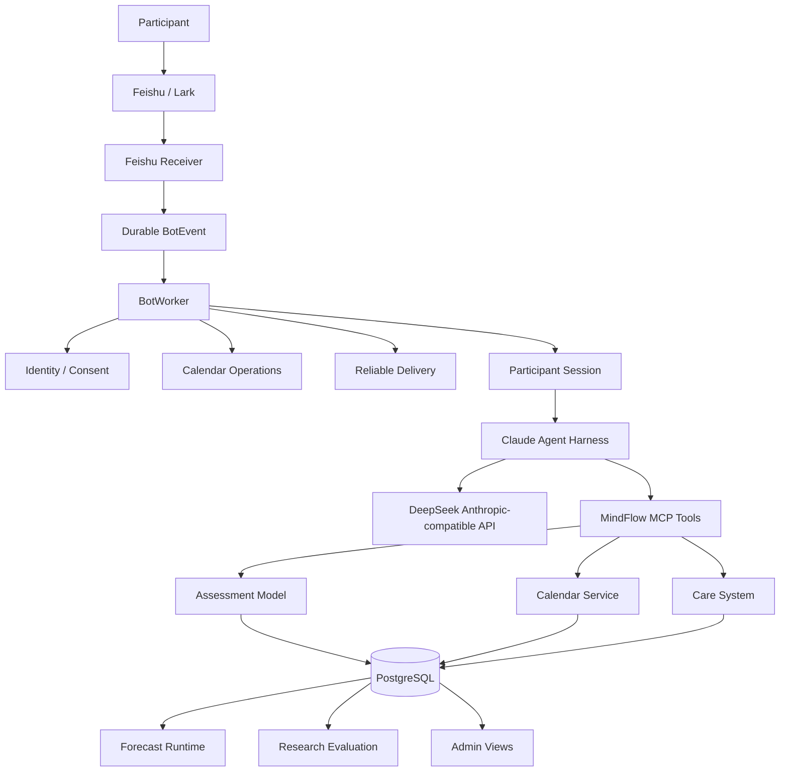
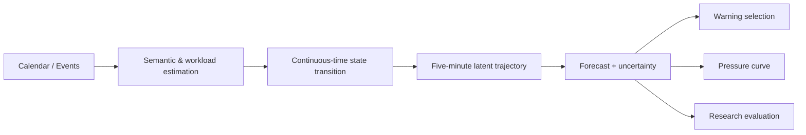
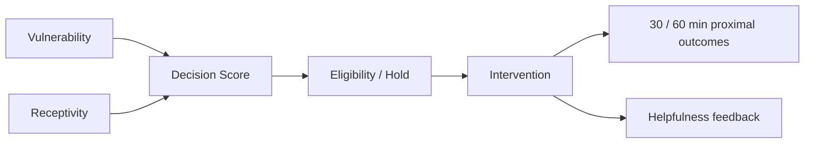

# MindFlow

<p align="center">
  <strong>Longitudinal stress modeling, personalized forecasting, and context-aware support for university students.</strong>
</p>

<p align="center">
  <a href="https://github.com/LIZZYGREAT/MentalProject/actions/workflows/ci.yml">
    
  </a>
  
  
  
  
</p>

MindFlow is a research-oriented system for **continuous stress-state modeling and personalized support** in university settings.

Instead of treating stress as a static questionnaire score, MindFlow models it as a time-varying latent process influenced by schedule workload, recovery opportunities, recent observations, and participant-specific parameters. The research modeling core is connected to a production Feishu/Lark runtime with calendar-aware forecasting, longitudinal data collection, evidence-gated personalization, and context-aware JITAI-style intervention selection.

> **Research boundary:** MindFlow is an engineering and research system. It is not a clinical diagnostic tool and does not claim validated clinical risk prediction or causal treatment effects.

---

## Why MindFlow

Stress is dynamic. A participant may experience very different pressure trajectories depending on schedule density and course workload, task timing and recovery opportunities, recent stress and energy observations, previous-day state, and participant-specific stress reactivity and recovery characteristics.

MindFlow therefore separates **state time** from **knowledge time**: the system records not only when an event happened, but also when observations, forecasts, learned profiles, and promotion evidence became available. This distinction is enforced in historical views and research evaluation to prevent future-information leakage.

---

## Core Capabilities

| Capability | What MindFlow provides |
|---|---|
| **Longitudinal Modeling** | Continuous-time latent stress-state estimation and five-minute trajectory simulation |
| **Workload-aware Forecasting** | Calendar/event semantics, workload estimation, pressure curves, peak-risk analysis |
| **Personalization** | Hierarchical participant parameter learning with evidence-gated runtime promotion |
| **Runtime Agent** | Feishu/Lark conversational runtime behind a constrained MCP tool boundary |
| **Context-aware Care** | Warning, check-in, Daily Review, JITAI-style intervention selection and proximal outcomes |
| **Research Evaluation** | Immutable snapshots, rolling-origin evaluation, uncertainty and identifiability diagnostics |
| **Operations** | PostgreSQL persistence, Admin research views, Alembic migrations, Docker deployment, CI |

---

## System Architecture



The production Agent does not receive participant identity through model-generated arguments. Identity is frozen by backend context, and business access is restricted to an explicit MCP tool set.

Detailed design: [Architecture](docs/ARCHITECTURE.md)

---

## Modeling

MindFlow uses a family of continuous-time state-space models.

| Variant | State extension |
|---|---|
| **M0** | Baseline stress dynamics |
| **WM0** | Workload-aware M0 |
| **M1** | Stress + vitality |
| **M2** | + perseverative cognition |
| **M3** | + recovery debt / fatigue |

**M0 remains the stable fallback.** Richer variants are candidates and are not assumed to outperform the baseline.



The same reviewed simulation path is reused by production forecasting and model evaluation rather than maintaining separate research and runtime implementations.

More detail: [Modeling](docs/MODELING.md)

---

## Evidence-gated Personalization

Stage 5 introduces bounded hierarchical partial pooling for participant-level parameters, including participant stress baseline, workload sensitivity, recovery sensitivity, stress reactivity, and stress recovery rate.

A participant-specific parameter set is not activated merely because it was learned. Runtime promotion requires sufficient longitudinal evidence and durable validation proof.

Key gates include:

- minimum observed-day and EMA coverage;
- workload-level diversity;
- recovery-episode coverage;
- rolling-origin out-of-time evaluation;
- parameter identifiability;
- stable forecast/coverage behavior;
- durable promotion evidence.

Candidate and rejected profiles remain visible for research audit without silently replacing the runtime-active profile.

A residual Ridge model is also used for research diagnostics, but it remains **shadow-only** and does not modify production trajectories.

More detail: [Personalization](docs/PERSONALIZATION.md)

---

## Context-aware JITAI-style Care

Stage 6 adds a transparent decision layer:



The runtime records vulnerability and receptivity scores, decision context, intervention type and delivery, participant action, 30/60-minute proximal outcomes, and helpfulness feedback.

The current care-effect pipeline is **observational and descriptive**. Contracts are MRT-ready, but this repository does not claim that a randomized micro-randomized trial has already been completed.

---

## Evaluation & Research Integrity

MindFlow evaluation is designed around prospective validity rather than only in-sample fit.

The repository includes immutable dataset snapshots, expanding rolling-origin splits, point-in-time runtime-active profile resolution, state-time / knowledge-time separation, forecast provenance, interval coverage analysis, peak timing and magnitude error, observable-support checks, parameter identifiability diagnostics, and durable model-promotion evidence.

Historical views fail closed when evidence was created or updated after the requested knowledge cutoff.

The repository implements the evaluation framework and promotion gates. Whether richer variants empirically outperform M0 remains a study result that must be demonstrated using collected participant data.

More detail: [Evaluation](docs/EVALUATION.md)

---

## Technology Stack

| Area | Technology |
|---|---|
| Language | Python |
| Modeling | NumPy, custom continuous-time state-space simulation |
| Personalization | Hierarchical partial pooling, Ridge shadow diagnostics |
| Agent Runtime | Claude Agent SDK / Claude Code Harness |
| LLM Provider | DeepSeek Anthropic-compatible API |
| Tool Boundary | MCP |
| Messaging | Feishu / Lark |
| Calendar | Feishu Calendar API |
| Database | PostgreSQL |
| Backend / Admin | Starlette |
| Visualization | Matplotlib + Admin Web UI |
| Deployment | Docker Compose |
| Migration | Alembic |
| Testing | Pytest + PostgreSQL integration tests |
| CI | GitHub Actions |

---

## Repository Layout

```text
MentalProject/
├── algorithm/              # CTSSM modeling core
├── calibration/            # trajectory validation
├── core_engine/            # simulator, timeline and state transitions
├── entity/                 # participant/model entities
├── entry/                  # course and configuration data
├── event/                  # domain events
├── services/               # workload, semantics and lifecycle services
├── settings/               # model and runtime defaults
├── utils/                  # shared helpers
├── claude-runtime/         # constrained Agent / Skill environment
├── mindflow-bot-runtime/   # production backend and deployment runtime
└── docs/                   # research and architecture documentation
```

The repository intentionally keeps the shared modeling/research core separate from the production runtime rather than physically reorganizing active code only for presentation.

---

## Documentation

| Document | Purpose |
|---|---|
| [Architecture](docs/ARCHITECTURE.md) | End-to-end architecture |
| [Modeling](docs/MODELING.md) | CTSSM variants and forecasting |
| [Personalization](docs/PERSONALIZATION.md) | Participant-level parameter learning |
| [Evaluation](docs/EVALUATION.md) | Validation and promotion gates |
| [Data & Privacy](docs/DATA_AND_PRIVACY.md) | Data boundaries and privacy |
| [Runtime](docs/RUNTIME.md) | Runtime system design |
| [Current Architecture](docs/CURRENT_ARCHITECTURE.md) | Authoritative production facts |
| [Research Data Contract](docs/RESEARCH_DATA_CONTRACT.md) | Research schema and semantics |
| [Production Runtime README](mindflow-bot-runtime/README.md) | Deployment and operator commands |

---

## Research Boundaries

MindFlow deliberately separates implemented engineering capability from empirical or clinical claims.

The repository does **not** claim that MindFlow diagnoses mental disorders, that forecast outputs are clinically validated risk scores, that richer CTSSM variants outperform M0 without study evidence, that the Stage 5 residual model is production-active, that observational care outcomes demonstrate causal treatment effects, or that a randomized MRT has already been completed.

These constraints are enforced in runtime contracts, evaluation logic, and documentation.

---

## Stage 6 Research Freeze

The reviewed Stage 6 research/runtime baseline is tagged:

```text
mindflow-stage6-freeze-2026-09
```

The freeze covers CTSSM forecasting, workload-aware modeling, evidence-gated variants, hierarchical personalization, rolling-origin evaluation, runtime-active model/profile promotion, JITAI-style intervention selection, proximal outcome tracking, research Admin views, and production PostgreSQL/runtime contracts.

Branch roles:

- **`main`** — stable public / research-facing project line;
- **`production_runtime`** — deployment and continued runtime development.

Exact deployment and operator commands live in the [production runtime README](mindflow-bot-runtime/README.md).
