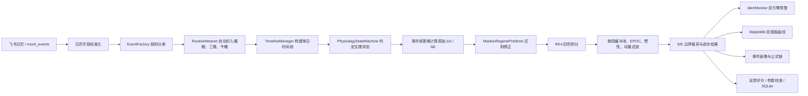
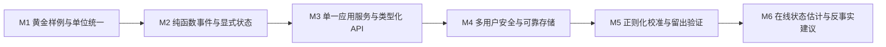

# 心理压力—精力双变量仿真项目：全代码、公式与架构说明

> 文档基于当前工作区代码逐文件核对，生成于 2026-07-30。  
> 当前分支：`local/ver3.0.0`。  
> 适用对象：后续维护者、算法调参者、前后端开发者、课程设计/答辩读者。  
> 重要边界：本项目是一个解释性仿真与研究沙盒，不是医学诊断工具。`S`、`E`、韧性、预警等级都是项目内部构造的状态量，不能直接等同于临床量表或疾病结论。

---

## 1. 一句话认识项目

项目读取飞书日历或用户手工注入的日程，把每条日程分类为课程、任务、运动、自习、就餐、午睡、睡眠或休息；随后以默认 5 分钟为一个离散步长，同时推演：

- 心理压力 `S(t)`，合法范围 `[0, 150]`；
- 认知精力 `E(t)`，合法范围 `[0, 100]`；
- 连续负荷、睡眠债、EPOC、能量缓冲、多巴胺缓冲等隐含状态；
- `NORMAL / FLOW / FRICTION` 三种半马尔可夫区制；
- 白天、深夜活动、夜间加班、例行维护、恢复睡眠等生理状态；
- 基于绝对压力水位与持续高压积分的黄/橙/红预警；
- 一天结束后的压力平衡点 `S*` 与承压阈值缓慢演化。

最终结果通过 Flask API 返回，前端展示压力/精力曲线、事件贡献、公式展开、预警和引擎日志；用户反馈还可以进入 SQLite，并用于轻量参数搜索。

---

## 2. 项目当前真正实现了什么

### 2.1 已经贯通的主链路



### 2.2 当前架构性质

它不是一个端到端机器学习模型，而是“专家规则 + 连续/离散混合动力学 + 随机区制 + 反馈校准”的白盒系统：

1. **专家规则层**：课程强度、任务类型、休息类型、睡眠惩罚等由显式公式定义。
2. **连续状态层**：`S` 与 `E` 随时间变化，并由 RK4 组合每一步增量。
3. **离散状态层**：生理状态机和半马尔可夫区制改变连续增量的方向和幅度。
4. **随机层**：固定种子的高斯噪声、AR(1) 噪声和小概率异常区制跳变。
5. **反馈层**：根据早/中/晚反馈、趋势、峰值时间和报警等级计算损失，再做轻量随机搜索。

### 2.3 当前没有实现或没有完全实现的内容

- 没有真正的神经网络、HMM 训练、梯度反向传播。
- 校准器不是梯度下降，而是“前期全局均匀采样 + 后期围绕当前最优点缩小半径”的随机搜索。
- `User.save_config()` 与 `_load_config()` 当前被显式禁用，用户配置只在内存中有效。
- 没有自动化测试目录、`README`、打包配置、容器配置或 CI。
- `EventBus`、`local_cache` 中的压力记录接口、`data_pipeline.process_date()` 等属于备用或尚未被 Web 主链路直接采用的能力。

---

## 3. 技术栈、运行方式与依赖

### 3.1 技术栈

| 层次 | 技术 | 在项目中的用途 |
|---|---|---|
| 语言 | Python 3 | 全部后端、算法、数据接入与绘图 |
| Web | Flask | 页面渲染与 JSON API |
| 数值 | NumPy | 随机数、数学辅助 |
| 绘图 | Matplotlib，`Agg` 后端 | 服务端生成 PNG，再编码为 base64 |
| 文本 | SnowNLP + 关键词规则 | 课程描述情感分与喜好因子 |
| 网络 | Requests | 飞书 OAuth、主日历与事件 API |
| 配置 | python-dotenv + 环境变量 | 加载飞书凭据 |
| 持久化 | SQLite、JSON | 校准反馈/运行记录；令牌与日历 ID |
| 前端 | HTML、原生 JavaScript、Bootstrap、MathJax | 调试台、请求 API、渲染公式与结果 |

`info/requirements.txt` 声明的固定版本为：

```text
numpy==1.26.4
matplotlib==3.8.3
Flask==3.0.2
requests==2.31.0
python-dotenv==1.0.1
snownlp==0.12.3
lark-oapi==1.4.10
```

当前代码的飞书主路径已经改用 `requests` 直接访问 REST API，`lark-oapi` 在现有 Python 源码中没有实际导入，因此它现在是可疑的遗留依赖。实际检查环境为 Python 3.9.0、NumPy 2.0.2、Matplotlib 3.9.2、Flask 3.1.2、Requests 2.32.5，和锁定清单并不一致；这意味着“开发机可运行”不能替代干净环境的依赖验证。

### 3.2 本地运行

在项目根目录执行：

```powershell
python -m pip install -r info/requirements.txt
python entry/app.py
```

默认地址为：

```text
http://127.0.0.1:5000
```

默认 OAuth 回调为：

```text
http://127.0.0.1:5000/callback
```

飞书配置由根目录 `.env` 或 `info/.env` 提供。代码支持：

```text
FEISHU_APP_ID
FEISHU_APP_SECRET
FEISHU_REDIRECT_URI
FEISHU_CALENDAR_ID
FEISHU_OPEN_ID
```

也兼容部分无 `FEISHU_` 前缀的旧名称。令牌文件和 `.env` 都不应提交到版本库。

---

## 4. 目录与逐文件职责

### 4.1 `algorithm/`：可复用数学原语

| 文件 | 关键符号 | 具体职责 |
|---|---|---|
| `mental_models.py` | `calculate_resilience_index` | 把四类策略选择映射为 `[-1,1]` 韧性分 |
| `physiology.py` | `clamp_*`、`step_scale`、`hill_response`、`hyperbolic_habituation` 等 | 通用边界、步长换算、昼夜/睡眠债倍率、Hill/Logistic/习惯化函数 |
| `high_load.py` | `HighLoadProfile`、`calculate_high_load_impact` | 统一课程与任务的压力/精力公式 |
| `recovery.py` | `trait_parameters`、`boosted_recovery_delta_s` | 就餐与午睡共享的恢复放大 |
| `integration.py` | `rk4_step`、`Rk4StepResult` | 对 `S/E` 两变量执行四阶 Runge–Kutta 组合 |
| `micro_dynamics.py` | `MicroDynamicState`、`apply_micro_dynamics` | 能量缓冲、内耗池、多巴胺、EPOC、动量、基础代谢 |
| `time_utils.py` | 时间解析与区间函数 | 将混合时间格式归一化，计算时长、跨午夜时长和区间重叠 |
| `__init__.py` | 包标识 | 当前无运行逻辑 |

### 4.2 `event/`：领域事件与每步冲击

| 文件 | 事件类型 | 实现重点 |
|---|---|---|
| `base.py` | 抽象基类 | 统一 ID、时间、名称、描述、元数据、序列化和双变量冲击接口 |
| `course_event.py` | `course` | 课程字典查表、CIS、情感喜好、课程压力与耗能 |
| `task_event.py` | `task` | exam/ddl/meeting/homework/general 权重与高负荷公式 |
| `gym_event.py` | `gym` | 运动耗能、减压、负疲劳权重与 EPOC 注入 |
| `library_event.py` | `library` | 时长衰减专注度、韧性心流抵消、tanh 限幅 |
| `rest_event.py` | `rest/meal/nap/sleep` | 泛休息、就餐、午睡还债、睡眠委托 |
| `__init__.py` | 包标识 | 当前无运行逻辑 |

### 4.3 `strategy/`：用户差异的策略模式

| 文件 | 关键类 | 具体职责 |
|---|---|---|
| `base.py` | `BaseStrategy` | 保存参数、约束 `get_name()` |
| `course_strategy.py` | 4 类 `StressFunctionStrategy`、3 类连续负荷惩罚、`CourseStrategy` | 压力敏感曲线、低精力放大、连续负荷惩罚、时段偏好 |
| `night_strategy.py` | normal/deep/anxious | 睡眠压力回落、周期振荡、AR(1) 噪声、精力饱和恢复 |
| `rest_strategy.py` | relieved/warmup/anxious/burnout | 日间恢复速度、启动延迟、噪声和能量恢复 ODE |
| `__init__.py` | 包标识 | 当前无运行逻辑 |

### 4.4 `core_engine/`：仿真编排核心

| 文件 | 关键类 | 具体职责 |
|---|---|---|
| `timeline_manager.py` | `TimelineManager` | 分析起床/入睡边界，查询当前高负荷与例行事件 |
| `state_machine.py` | `PhysiologyStateMachine` | 判定生理状态、睡眠打断惩罚、碎片化睡眠效率 |
| `markov_predictor.py` | `MarkovRegimePredictor` | 计算承压势能、驻留风险、区制跳转与方向性修正 |
| `simulator.py` | `Simulator`、`RestSession` | 一天 24 小时主循环、RK4、微观池、画像、预警 |
| `__init__.py` | 包标识 | 当前无运行逻辑 |

### 4.5 `entity/`

`user.py` 的 `User` 是聚合根：

- 深拷贝全局默认参数；
- 创建课程、睡眠、休息策略；
- 创建 `Simulator`；
- 保存睡眠债和 EPOC；
- 计算策略韧性；
- 更新 `S*` 与阈值；
- 提供参数别名和后备值解析。

虽然类中仍保留配置文件路径与 JSON 转换函数，但读写函数当前直接返回 `None`，所以配置并不持久化。

### 4.6 `data_pipeline/`

| 文件 | 职责 |
|---|---|
| `fetcher.py` | 令牌/日历 ID 解析、15 秒外层超时、5 分钟内存 TTL 缓存 |
| `local_cache.py` | 日历 JSON、压力记录 JSON 的旧式本地缓存接口 |
| `orchestrator.py` | 可复用的“取事件—分类—织入例行—模拟—演化—绘图”流程 |
| `__init__.py` | 包标识 |

Web 的 `/api/simulate` 当前自行实现了一套与 `process_date()` 相似的编排，因此存在重复逻辑。

### 4.7 `utils/`

| 文件 | 职责 |
|---|---|
| `event_factory.py` | 按显式类型与正则优先级创建领域事件 |
| `routine_weaver.py` | 自动插入睡眠、午餐、午睡、晚餐并计算睡眠债 |
| `description_score.py` | SnowNLP + 关键词三梯度打分与 `F_like` |
| `alert_monitor.py` | 压力水位 + 持续高压 AUC 双引擎预警 |
| `calendar_tool.py` | 飞书事件分页拉取、周期事件日期校准、字段标准化 |
| `get_token.py` | 环境加载、OAuth URL、换取/刷新/保存令牌 |
| `get_calendar_id.py` | 获取主日历 ID 与 owner open_id |
| `event_bus.py` | 轻量发布订阅与历史记录；当前主链路未使用 |

### 4.8 `calibration/`

| 文件 | 职责 |
|---|---|
| `metrics.py` | 反馈归一化、锚点误差、趋势、峰值、报警评分与总损失 |
| `parameter_validation.py` | 参数范围、跨参数约束、警告与裁剪 |
| `simulation_runner.py` | 无绘图的一日快速仿真 |
| `calibrator.py` | 确定性随机的全局/局部参数搜索 |
| `storage.py` | SQLite 表结构与写入接口 |
| `__init__.py` | 暴露部分校准能力 |

### 4.9 `entry/`、`templates/`、`visualization/`

- `entry/app.py`：Flask 入口与 10 个 Web/API 路由。
- `entry/config.py`：运行时参数中心，共 21 个参数组。
- `entry/class_info_data.py`：1,612 门课程的静态字典。每条通常含 `credits`、`hours`、`hours_per_week`、`code`、起止日期；数据当前没有 `level` 字段，因此课程等级通常回退为 `C`。
- `entry/feishu_config.py`：从环境变量暴露飞书配置。
- `templates/index.html`：单页调试台，内嵌 CSS 与 JavaScript。
- `visualization/plotter.py`：压力、置信度、精力、事件色块与报警绘图。
- `settings/*.py`：常量、路由关键词、文本词典、参数兼容别名和绘图默认值。

### 4.10 `data/` 与 `info/`

- `data/user_token.json`：OAuth 令牌，敏感文件，不应进入文档、日志或版本库。
- `data/calendar_info.json`：日历 ID 与 open_id，同样应谨慎处理。
- `data/calibration/calibration.sqlite3`：反馈、曲线、版本与校准记录。
- `info/requirements.txt`：依赖清单。
- 其他 `info/*.md`：历史设计、改进构想和提示材料；其中的设想不一定与当前实现一致。

---

## 5. 核心领域模型与符号

### 5.1 主状态

| 符号/字段 | 含义 | 默认或边界 |
|---|---|---|
| `S(t)` | 项目内部心理压力状态 | `[0,150]` |
| `E(t)` | 项目内部认知精力状态 | `[0,100]` |
| `S*` | 压力稳态锚点 | 默认 `50` |
| `S_threshold` | 承压/报警阈值 | 默认 `100` |
| `E_critical` | 精力危险线 | 默认 `20` |
| `ΔS, ΔE` | 一个仿真步的状态增量 | 事件、策略、区制与微观层共同决定 |
| `continuous_load_hours` | 按事件疲劳权重累计的连续负荷小时 | 高负荷时增加，空闲时恢复 |
| `sleep_debt` | 睡眠债小时数 | 自动作息织入器计算，可被午睡偿还 |
| `epoc_level` | 延迟恢复池 | 运动、就餐、午睡注入；休息时吸收 |

### 5.2 步长换算

默认步长 `Δt=5 min`。代码有两种常用比例：

$$
r_{5m}=\frac{\Delta t}{5},\qquad
r_h=\frac{\Delta t}{60}
$$

- “每 5 分钟定义的增量”乘 `r_{5m}`；
- “每小时定义的速率”乘 `r_h`。

最终：

$$
S_{k+1}=\operatorname{clip}(S_k+\Delta S_k,0,150)
$$

$$
E_{k+1}=\operatorname{clip}(E_k+\Delta E_k,0,100)
$$

一天默认产生 `24×60/5=288` 个结果点。

### 5.3 生理状态

`PhysiologyStateMachine` 输出：

| 状态 | 触发条件概要 |
|---|---|
| `DAY_ACTIVE` | 起床后、夜间入睡前，存在高负荷；或无例行事件的普通白天 |
| `LATE_NIGHT_ACTIVE` | 起床前仍有高负荷，或起床前无睡眠事件 |
| `NIGHT_OVERTIME` | 夜间入睡边界之后仍有高负荷 |
| `ROUTINE_MAINTENANCE` | 就餐、午睡、泛休息等所有非 sleep 例行事件统一使用此状态 |
| `RECOVERY_SLEEP` | 起床前的 `SleepEvent` |
| `NIGHT_SLEEP` | 起床后的 `SleepEvent`，或夜间边界后无高负荷 |

若上一状态属于睡眠，而当前进入 `LATE_NIGHT_ACTIVE/NIGHT_OVERTIME`，就施加默认：

$$
\Delta S_{interrupt}=+2,\qquad \Delta E_{interrupt}=-5
$$

第 `n` 次睡眠打断后的效率为：

$$
\eta_{sleep}=
\max\left(0.5,\ 0.8-0.1(n-1)\right)
$$

睡眠中只有减压项和正向精力恢复项乘此效率。

---

## 6. 参数中心：设计意图与默认值

`entry/config.py::GLOBAL_DEFAULT_CONFIG` 是运行时模型参数的主来源；`settings/model_defaults.py` 存放应用边界、状态名、目录名、兼容别名与少数后备值。

### 6.1 课程、环境与全局状态

| 参数 | 默认 | 作用 |
|---|---:|---|
| `w1,w2,w3` | `0.4,0.2,0.3` | CIS 中课业密度、时段、偏好的权重；三者当前和为 `0.9`，没有强制归一化 |
| `lambda_like` | `0.25` | 喜好因子对 CIS 的乘性影响 |
| `time_weights` | 7 个时段 | 课程开始小时的基础权重 |
| `Z_awake,Z_factor` | `0.5,0.5` | 环境压力倍率的输入 |
| `K_resilience` | `1.0` | 耗能分母、休息恢复乘数 |
| `S_star_init` | `50` | 初始压力锚点 |
| `S_threshold` | `100` | 报警与生态演化阈值 |
| `time_step` | `5` | 离散步长，分钟 |
| `random_seed` | `42` | 可重复随机源 |
| `fatigue_acceleration` | `0.15` | 单事件内部随持续时间加速耗能 |

`Z_avoid/Z_cogload/Z_info/Z_help/Z_valence`、`alpha_cis_drain`、`cognitive_weight`、`noise_scale_factor` 当前只存在于配置或校验中，没有进入主公式。`max_delta_base` 能被策略查询，但主引擎没有用它统一裁剪 `ΔS`。

### 6.2 非稳态负荷与全局惩罚

| 参数 | 默认 | 作用 |
|---|---:|---|
| `allostatic_collapse_point` | `0.35` | 精力比例低于此附近后压力放大更明显 |
| `allostatic_collapse_steepness` | `10` | 放大曲线陡峭度 |
| `allostatic_max_penalty` | `0.25` | 最大额外压力放大 |
| `allostatic_cost_alpha/beta` | `0.75/1.5` | 低精力耗能倍率 |
| `penalty_circadian.drain_multiplier` | `1.4` | 22:00–06:00 高负荷耗能放大 |
| `penalty_sleep_debt.drain_k` | `0.05` | 每小时睡眠债的耗能斜率 |
| `penalty_sleep_debt.stress_k` | `0.04` | 每小时睡眠债的增压斜率 |

配置还含 `penalty_circadian.stress_multiplier=1.2`，但高负荷共享公式当前只使用昼夜耗能倍率，没有使用昼夜压力倍率。

### 6.3 事件先验

- 课程：`D_t_course=0.80`、`course_base_drain=5.5`。
- 任务：`D_t_task=0.55`、`task_base_drain=5.0`。
- 任务权重：exam `1.10`、ddl `1.05`、meeting `0.85`、homework `0.95`、general `0.90`。
- 运动：耗能率 `5.5`，疲劳权重系数 `-2.0`，EPOC 基础 `1.5`，强度系数 `2.0`。
- 自习：基础耗能 `0.75`、基础压力 `0.60`、心流抵消 `0.020`、单步压力软上限 `1.2`。
- 就餐/午睡：Hill 半饱和值 `15`、指数 `2`、Logistic 下限 `0.75`，再按餐别/小睡类型乘恢复倍率。

### 6.4 策略先验

- `f_strategy_params`：sensitive/dull/saturated/batterydrain 四种压力敏感曲线。
- `c_strategy_params`：high/threshold/low 三种连续负荷惩罚。
- `night_normal/night_deep/night_anxious`：AR(1) 系数、噪声标准差、锚点拉回系数。
- `rest_relieved/rest_warmup/rest_anxious/rest_burnout`：相位、效率、噪声、惯性耗能率。
- `rest_trait_modifiers`：就餐/午睡 Hill 减压的 `eta` 与时间曲线的 `tau`。
- `time_pref_weights`：喜欢/不喜欢早、中、晚时段时覆盖基础时段权重。

### 6.5 微观、宏观和预警

| 参数组 | 关键默认 | 设计意义 |
|---|---|---|
| `simulator_micro_params` | 动量 `0.10`、基础耗能 `0.415`、缓冲释放 `0.05`、EPOC 吸收 `1.5` | 控制事件公式之外的慢变量与滤波 |
| `markov_semi_params` | 检查间隔 `25min`、Weibull 形状 `1.5`、异常概率 `0.01` | 控制 FLOW/FRICTION/NORMAL 驻留与跳变 |
| `markov_modifiers` | FRICTION 压力 `1.05–1.15`、FLOW 压力 `0.85–0.95` | 按区制有方向地缩放增压/减压、耗能/恢复 |
| `alert_thresholds` | AUC 黄 `50`、橙 `80`、红 `100` | 持续高压预警 |
| `evolution_params` | `alpha_star=0.015`、阈值每日变化约 `0.05–0.25` | 日际慢速适应 |
| `habituation_params` | floor `0.35`、半衰参数 `40min` | 长事件的刺激习惯化 |
| `routine_weaver` | 8h 理想睡眠、11:40 午餐、17:40 晚餐等 | 自动例行事件的时间先验 |

---

## 7. 事件如何从文本变成对象

### 7.1 飞书事件标准化

`calendar_tool.extract_event_data()`：

1. 过滤 `status=cancelled`；
2. 过滤空标题；
3. 从飞书 `start_time.timestamp/end_time.timestamp` 转成 `HH:MM`；
4. 单日查询时，将周期事件校准到查询日期，但要求原事件星期和查询日期星期一致；
5. 输出统一字段：

```json
{
  "date": "2026-07-07",
  "start_time": "08:00",
  "end_time": "09:40",
  "summary": "高等数学课",
  "description": "今天公式很多",
  "actual_start_timestamp": 0,
  "actual_end_timestamp": 0
}
```

### 7.2 `EventFactory` 路由优先级

路由不是机器学习分类，而是严格的先后顺序：

1. 显式 `event_type=course/rest/gym/library`；
2. 名称命中餐饮、睡眠、健身、自习关键词；
3. 命中考试、DDL、会议、作业关键词；
4. 名称存在于 1,612 门课程字典，或含“课”；
5. 兜底为 `TaskEvent(task_type="general")`。

例如：

| 标题 | 结果 | 原因 |
|---|---|---|
| `午餐` | `MealEvent` | 命中“餐” |
| `图书馆复习` | `LibraryEvent` | 自习规则先于任务规则 |
| `项目DDL提交` | `TaskEvent(ddl)` | 命中 `ddl/提交` |
| `高等数学课` | `CourseEvent` | 含“课” |
| `整理资料` | `TaskEvent(general)` | 兜底 |

注意：显式 `event_type="task"` 没有专门分支，仍会继续关键词判断；`EXPLICIT_EVENT_TYPES` 常量列出了 task，但工厂没有对应处理，这是一处实现不一致。

### 7.3 描述情感与喜好

课程标题先验：

- “高等、理论、算法、力学”等返回约 `4.0`；
- “艺术、体育、音乐、讲座”等返回约 `6.5`；
- 其他默认 `5.0`。

若有描述，SnowNLP 情感概率 `p∈[0,1]` 先映射：

$$
Score_{NLP}=1+9p
$$

再以标题 30%、描述 70% 融合：

$$
Score_{raw}=0.3Score_{summary}+0.7Score_{NLP}
$$

随后三档压力词与正负词执行硬规则加减和上限截断。最后：

$$
F_{like}=\operatorname{round}\left(\frac{Score-5}{5},3\right)
$$

因此 `F_like=-1` 表示强烈不喜欢/高压，`0` 中性，`+1` 非常喜欢。

---

## 8. 各类事件的公式与实现

### 8.1 课程：CIS 强度指数

课程初始化时优先从 `CLASS_INFO_DICT` 按完整课程名查学分与学时；查不到则默认：

```text
credits = 2.5
hours   = 60
level   = C
```

等级系数：

$$
L=
\begin{cases}
1.0,& level\in\{A,A+\}\\
0.8,& level\in\{B,B+\}\\
0.5,& 其他
\end{cases}
$$

基础课业密度采用平方根压缩：

$$
I_{basic}=2.5L\sqrt{\frac{credit}{\max(1,hours)}}
$$

设课程开始时段权重为 `T_weight`，用户时间偏好权重为 `P_weight`，则：

$$
CIS_0=w_1I_{basic}+w_2T_{weight}+w_3P_{weight}
$$

喜好修正：

$$
CIS=
\begin{cases}
CIS_0(1-\lambda F_{like}),&F_{like}>0\\
CIS_0(1+\lambda|F_{like}|),&F_{like}\le 0
\end{cases}
$$

最终裁剪到 `[0.5,2.5]`。

注意两个实现细节：

1. 课程数据的 1,612 条记录目前都没有 `level` 字段，因此绝大多数查表课程会回退为 `C`，等级系数为 `0.5`。
2. `credit_count=credit/16` 被保存为成员，但没有进入后续公式。

### 8.2 课程/任务共享高负荷公式

`algorithm/high_load.py` 通过 `HighLoadProfile` 把课程 CIS 或任务权重传进同一条链。

#### 8.2.1 单事件内部疲劳加速

若配置值 `a=fatigue_acceleration` 大于 1，代码把它解释为历史“倍率式配置”，先转换为 `a-1`；否则直接当斜率。斜率裁剪到 `[0,0.5]`：

$$
Acc(t)=1+a\frac{t_{elapsed}}{60}
$$

这使前端传入 `fatigue_accel=1.25` 实际变成斜率 `0.25`，而默认 `0.15` 直接是斜率 `0.15`。

#### 8.2.2 睡眠债倍率

$$
M_{debt,E}=1+k_E\max(0,debt)
$$

$$
M_{debt,S}=1+k_S\max(0,debt)
$$

默认 `k_E=0.05`、`k_S=0.04`。若睡眠债为 2 小时，则耗能乘 `1.10`，增压乘 `1.08`。

#### 8.2.3 深夜倍率

在 `hour>=22` 或 `hour<6` 时：

$$
M_{circadian,E}=1.4
$$

其他时段为 `1`。共享公式当前没有使用配置中的 `stress_multiplier=1.2`。

#### 8.2.4 环境倍率

令 `z=max(0,Z_awake·Z_factor)`：

$$
Z_{env}=0.8+0.4\frac{\ln(1+z)}{\ln 2}
$$

默认 `z=0.25`，得到约 `0.929`。

#### 8.2.5 刺激习惯化

令 `μ_floor=0.35`、`T_half=40min`：

$$
\Theta(t)=\mu_{floor}+(1-\mu_{floor})\frac{T_{half}}{T_{half}+t}
$$

在事件刚开始时为 `1`；40 分钟时为 `0.675`；无限久后趋近 `0.35`。这会逐步减弱同一课程/任务的压力刺激，但不会直接减弱耗能，耗能反而受 `Acc(t)` 加速。

#### 8.2.6 压力生成与精力消耗

令 `W` 为课程 CIS 或任务权重：

$$
\dot S=f_s(S,E,S^*)·W·D_t·Z_{env}·\Theta(t)·M_{debt,S}
$$

因为模型把该压力项视为每 5 分钟基准增量：

$$
\Delta S=\dot S\frac{\Delta t}{5}
$$

精力侧：

$$
\dot E=-\frac{BaseDrain·W·Acc(t)}{K_{resilience}}
·M_{allostatic,E}·M_{debt,E}·M_{circadian,E}
$$

$$
\Delta E=\dot E\frac{\Delta t}{60}
$$

任务仅用 `exam/ddl/meeting/homework/general` 的权重代替 CIS，其余链完全相同。

### 8.3 四种压力敏感函数 `f_s`

所有策略最后都会乘低精力压力放大器，并加入步长锁定噪声：

$$
f_{noisy}=\max(0.05,f·(1+0.05\epsilon_S)),\qquad \epsilon_S\sim N(0,1)
$$

#### 8.3.1 低精力压力放大器

令 `e=clip(E,0,100)/100`，则代码为：

$$
Amp(E)=1+\lambda_{max}\left(1-\frac{1}{1+\exp[-k(e-E_c)]}\right)
$$

其中默认 `E_c=0.35`、`k=10`、`\lambda_max=0.25`。精力越低，放大越接近 `1.25`。

精力耗损倍率：

$$
M_{allostatic,E}=1+\alpha e^{-\beta e}
$$

默认 `α=0.75, β=1.5`，所以低精力时耗能倍率更高。

#### 8.3.2 sensitive

令 `d=S-S*`：

$$
f_{sens,raw}=
\begin{cases}
b+0.005|d|,&d\le 0\\
b+\frac{m}{1+\exp[-k(d-d_0)]},&d>0
\end{cases}
$$

默认 `b=0.80,m=0.30,d_0=17.5,k=0.15`。压力已高于平衡点时敏感度呈 Logistic 上升。

#### 8.3.3 dull

$$
f_{dull,raw}=
\begin{cases}
b,&d<T\\
b+k(d-T)^{1.1},&d\ge T
\end{cases}
$$

默认 `b=0.50,T=12,k=0.012`，表示压力没有积累到一定程度前反应迟钝。

#### 8.3.4 saturated

$$
f_{sat,raw}=
\begin{cases}
floor+capacity,&d\le0\\
floor+\frac{capacity}{1+\exp[\alpha(d-d_0)]},&d>0
\end{cases}
$$

默认 `floor=0.65,capacity=1,d_0=15,α=0.15`。高压时额外敏感度反而饱和下降，但仍有 floor。

#### 8.3.5 batterydrain

先定义风险：

$$
Risk=(S-S^*)-(e_kE+e_b)
$$

再：

$$
f_{battery,raw}=b+\frac{m}{1+\exp(-k·Risk)}
$$

默认 `e_k=0.15,e_b=2,k=0.4,b=0.45,m=0.8`。它把当前精力显式放入“压力是否破防”的判断。

### 8.4 连续负荷惩罚

高负荷时累计：

$$
H_{k+1}=H_k+\frac{\Delta t}{60}·\max(W_i)
$$

若并行事件含运动，运动权重可以为负。空闲白天且离开负荷超过默认 5 分钟后：

$$
H_{k+1}=\max\left(0,H_k-\frac{\Delta t}{60}r_{recovery}\right)
$$

超过策略阈值后，惩罚直接作为每步 `ΔS` 加入。

#### high

$$
P=S^*·\min(P_{max},k(H-T)^p)
$$

默认 `T=2.75h,r=1.25,k=0.0025,Pmax=0.004,p=1.35`。

#### threshold

$$
P=S^*·\min(P_{max},k[1-\exp(k_e(H-T))])
$$

默认 `T=3h,r=1.5,k=0.0275,Pmax=0.004,k_e=-1.5`，是快速趋于上限的饱和罚。

#### low

$$
P=S^*·\min(P_{max},k(H-T))
$$

默认 `T=3.5h,r=1.6,k=0.002,Pmax=0.0035`。

### 8.5 并行事件

若同一时刻有 `n>1` 个高负荷事件，代码先求和，再变换：

$$
\Delta X_{overlap}=
\frac{\sum_i\Delta X_i}{n}(1+c\ln n),\quad c=0.3,\ X\in\{S,E\}
$$

例如 `n=2` 时乘数约 `1.208`，但前面还有除以 2，所以最终只相当于原始总和的约 `60.4%`。这不是简单叠加，而是“平均负荷 + 对数并发惩罚”。

### 8.6 运动 `GymEvent`

强度 `I` 被裁剪到 `[0.1,1]`。

疲劳权重：

$$
W_{gym}=k_f(1+I),\quad k_f=-2
$$

因此它会降低连续负荷累计。

压力：

$$
Gap=\max(0,S-S^*)
$$

$$
\Delta S=-0.02I·Gap·\frac{\Delta t}{5}
+\epsilon_S(0.15+0.10I)
$$

并限制不能让 `S` 跌到 `S*-5` 以下。

精力：

$$
\Delta E=
-\frac{5.5I}{K_{resilience}}M_{allostatic,E}\frac{\Delta t}{60}
+\epsilon_E(0.10+0.10I)
$$

非 RK4 子步还会注入：

$$
EPOC_{add}=(1.5+2I+0.05)\frac{\Delta t}{5}
$$

运动当下消耗精力，后续休息时 EPOC 才转化为精力恢复与压力下降。

### 8.7 自习 `LibraryEvent`

普通事件不直接使用传入的 `study_intensity`，而按总时长计算专注度：

$$
I=\max(I_{min},I_{base}-h·k_{decay})
$$

默认 `I_base=0.95,k=0.125,I_min=0.45`。只有 ID 包含 `mock` 的沙盒事件才直接使用前端强度。

韧性为 `R`，压力差 `d=S-S*`：

$$
BaseStress=0.60I
$$

当 `d>0`：

$$
FlowRelief=0.020·R·d·I
$$

若 `R<0`，该项为负，公式 `BaseStress-FlowRelief` 反而增加压力，等价于焦虑内耗。

$$
\Delta S_{raw}=(BaseStress-FlowRelief)·Amp(E)·\frac{\Delta t}{5}
$$

再经平滑限幅：

$$
\Delta S=Limit·\tanh\left(\frac{\Delta S_{raw}}{Limit}\right)+0.05\epsilon_S
$$

默认 `Limit=1.2`。精力按专注度、韧性、睡眠债和低精力耗能倍率计算。

### 8.8 日间泛休息 `RestStrategy`

当 `S-S*>2` 时，子类生成基础减压速度；否则使用锚点弹簧与 AR(1) 噪声：

$$
\Delta S_{homeo}=
\operatorname{clip}(k_p(S^*-S),-0.5,0.5)+\eta_t
$$

AR(1) 噪声：

$$
\eta_t=\rho\eta_{t-1}+\sqrt{1-\rho^2}\sigma\epsilon_t
$$

远离平衡点时，子类基础减压再乘：

$$
Z_{rest}=0.8+0.4Z_{factor}
$$

最终同样不能低于 `S*-5`。

精力恢复采用“匮乏拉力 × 交感抑制”：

$$
Deficit=\frac{\max(0,100-E)}{100}
$$

$$
Inhibition=\exp[-\alpha\max(0,S-S^*)]
$$

$$
\Delta E=R_{max}·Deficit^\gamma·Inhibition
·Efficiency·K_{resilience}+\epsilon_E\sigma_E
$$

并截断为非负。默认 `Rmax=6`（按 5 分钟步长缩放）、`γ=2`、`α=0.02`。

四类减压曲线：

- **relieved**：开始快，随休息时长指数衰减；高压差按幂函数提升速度，效率 `1.05`。
- **warmup**：启动倍率约按 `(duration/20)^2.25` 增长，早期慢、后期快，效率 `1.0`。
- **anxious**：用 Logistic 表示约 25 分钟后才逐渐放松，并忽略最初约 5 点压力差，效率 `0.85`。
- **burnout**：只按 `log(1+diff)` 缓慢下降，效率 `0.70`；休息超过 60 分钟后还额外扣减精力。

### 8.9 就餐与午睡

两者先调用日间休息策略得到 `ΔS_base`，再用 Hill 与时间曲线放大负向减压。

压力差：

$$
x=\max(0,S-S^*)
$$

Hill 响应：

$$
H(x)=\frac{x^n}{K_{half}^n+x^n}
$$

时间阻尼：

$$
T(r,\tau)=b+(1-b)\exp[-\lambda r^\tau],\quad r\in[0,1]
$$

减压倍率：

$$
M_S=1+A_{max}\eta H(x)T(r,\tau)
$$

若 `ΔS_base<0`，则：

$$
\Delta S=\Delta S_{base}M_S
$$

精力吸收 Logistic：

$$
\alpha_E=lower+\frac{1-lower}{1+\exp[k(x-mid)]}
$$

压力差越大，直接精力恢复越受抑制。

就餐：

$$
\Delta E=E_{meal,total}·M_{meal}·\alpha_E·\frac{\Delta t}{Duration}
$$

午餐默认总恢复 `10`，晚餐 `15`；正常餐倍率 `1.15`，赶时间为 `0.85`。

午睡：

$$
\Delta E=E_{nap,total}·M_{nap}·\alpha_E·M_{debt}·\frac{\Delta t}{Duration}
$$

proper 默认总恢复 `20`、倍率 `1.4`；short 默认 `12`、倍率 `1.1`。若标记还债，则每真实步减少：

$$
\Delta Debt=\frac{\Delta t}{60}·2
$$

并用 `1.2` 放大恢复。

实现上，就餐和午睡还会把正 `ΔE` 暂存到微观 `energy_buffer`，不是立即全部加到 `E`。

### 8.10 睡眠

`SleepEvent` 不另写公式，而是委托 night strategy。

共同精力恢复：

$$
Sat_E=\max\left(0.05,\frac{100-E}{50}\right)
$$

高压力差超过 40 时先压缩：

$$
Gap_{eff}=40+0.2(Gap-40)
$$

$$
\Delta E=BaseRecover·Sat_E·e^{-Gap_{eff}/60}·M_{night}·\frac{\Delta t}{5}
$$

默认 `BaseRecover=2.2`。

压力侧包含：

1. 初始阶段对 `S-S*` 的指数式回拉；
2. 之后的锚点弹簧或线性衰减；
3. 约 75–100 分钟周期的正弦节律；
4. 高压时更大的非对称振幅；
5. AR(1) 噪声。

策略差别：

- **normal**：60 分钟初始相，标准恢复倍率；
- **deep**：初始相约 45 分钟、更强回拉、精力倍率约 `1.2–1.25`；
- **anxious**：初始相约 80 分钟、恢复受阻、噪声更大、`E` 上限额外限制在约 96。

---

## 9. 半马尔可夫区制

### 9.1 承压势能

输入特征：

- `fatigue`：连续负荷小时；
- `debt`：睡眠债小时；
- `intensity`：事件疲劳权重/强度；
- `resilience`：策略韧性；
- `event_type`：用于护盾。

线性势能：

$$
u=w_fF+w_dD+w_iI-w_rR-Shield(event)
$$

$$
\Phi=\tanh(u)
$$

默认权重 `0.15,0.30,0.50,0.40`。护盾：自习 `0.20`、运动 `0.50`、休息类 `0.30`。

### 9.2 驻留与跳变概率

每次检查时，把当前区制驻留分钟数除以检查间隔：

$$
d=\max\left(0.1,\frac{T_{regime}}{25}\right)
$$

不同区制的风险率：

$$
\lambda_{FLOW}=0.02e^{2\Phi}
$$

$$
\lambda_{FRICTION}=0.015e^{-1.5\Phi}
$$

$$
\lambda_{NORMAL}=0.01\cosh(1.2\Phi)
$$

Weibull 式本次跳变概率：

$$
P_{jump}=1-\exp(-\lambda d^{1.5})
$$

裁剪到最高 `0.99`。

另有每次检查 `1%` 的异常通道：

- FLOW 直接到 FRICTION；
- FRICTION 直接到 FLOW；
- NORMAL 按 `Φ` 正负选择 FRICTION/FLOW。

常规跳变拓扑：

- FLOW 或 FRICTION 只能先回 NORMAL；
- NORMAL 再按：

$$
P(FRICTION)=\frac{1}{1+\exp(-\kappa\Phi)},\quad \kappa=3
$$

选择 FRICTION，否则 FLOW。

### 9.3 区制对增量的方向性修正

FRICTION：

- 正 `ΔS` 乘 `M_S>1`，负 `ΔS` 除以 `M_S`；
- 负 `ΔE` 乘 `M_E>1`，正 `ΔE` 除以 `M_E`。

FLOW：

- 正 `ΔS` 乘 `M_S<1`，负 `ΔS` 除以 `M_S`，所以减压被放大；
- 负 `ΔE` 乘 `M_E<1`，正 `ΔE` 除以 `M_E`，所以恢复被放大。

敏感型、高强度、韧性和连续时长还会小幅修正乘数。

### 9.4 何时检查

除睡眠恢复态外，以下情况触发：

- 当前活动事件 ID 集合改变；
- `E` 首次跌破耗竭线；
- 距上次宏观检查达到 25 分钟；
- 一天开始。

当前 `Simulator` 重置随机源，但没有在 `simulate_day()` 开头显式把 `current_regime` 和 `regime_duration_minutes` 重置。因此同一个 `current_user.solver` 连续运行多次 Web 仿真时，区制可能从上次结果继续，这是需要明确决定的状态语义。

---

## 10. RK4、微观状态池与最终一步

### 10.1 RK4 在本项目中的用法

`_evaluate_derivatives()` 名称叫“导数”，但实际各事件返回的通常是已经按当前 `time_step` 缩放的单步增量。`rk4_step()` 将它们作为 `k1...k4`：

$$
k_1=f(S_k,E_k,t_k)
$$

$$
k_2=f(S_k+k_{1,S}/2,E_k+k_{1,E}/2,t_k+\Delta t/2)
$$

$$
k_3=f(S_k+k_{2,S}/2,E_k+k_{2,E}/2,t_k+\Delta t/2)
$$

$$
k_4=f(S_k+k_{3,S},E_k+k_{3,E},t_k+\Delta t)
$$

$$
\Delta X_{RK4}=\frac{k_1+2k_2+2k_3+k_4}{6}
$$

这里没有在外层再乘 `Δt`，因为事件函数内部已经完成 `Δt/5` 或 `Δt/60` 换算。

每个真实步只采样一对标准正态源 `εS,εE`，并传给四个子步，目的是避免四次独立噪声。然而 AR(1) 函数在 `k1` 的 `is_substep=False` 调用时会更新 `_last_noise`，导致 `k2-k4` 虽使用同一 `ε`，却可能基于更新后的 AR 状态重新计算；所以“噪声源锁定”已实现，“四子步噪声结果完全一致”并未严格实现。

### 10.2 微观持久池

一天开始创建：

```text
energy_buffer
friction_excess_stress
dopamine_buffer
momentum_s_1
momentum_s_2
```

这些池只在当前一次 `simulate_day()` 内持续。

#### 10.2.1 能量缓冲

就餐/午睡产生的正 `ΔE` 先全部进入 `energy_buffer`。每步释放：

$$
Release=B_E(1-e^{-k\Delta t})
$$

$$
B_{E,new}=B_E-Release
$$

默认 `k=0.05`。5 分钟一步时，约释放当前池的 `22.1%`，把瞬时回血平滑成拖尾恢复。

#### 10.2.2 FRICTION 内耗池与顿悟

在 FRICTION：

$$
B_F\leftarrow B_F+\max(0,\Delta S-\Delta S_{base})
$$

离开 FRICTION 后每步按默认 `0.2·Δt/5` 衰减。

只有异常通道可能直接让 `FRICTION→FLOW`；此时：

$$
Refund=\min(0.8B_F,8)
$$

$$
B_D\leftarrow B_D+2+Refund+1.5\max(0,R)
$$

并清空内耗池。多巴胺池每步默认释放 `0.15·Δt/5`：

$$
\Delta S\leftarrow \Delta S-Release_D
$$

$$
\Delta E\leftarrow \Delta E+0.4Release_D
$$

配置中的 `dopamine_leak_rate`、`wandering_cooldown_*` 当前没有进入微观实现。

#### 10.2.3 EPOC 吸收

若处于睡眠，或普通白天没有高负荷：

$$
Consume=\min(EPOC,1.5·\Delta t/5)
$$

$$
\Delta E\leftarrow\Delta E+Consume(0.6+0.2R)
$$

$$
\Delta S\leftarrow\Delta S-Consume(0.08+0.05R)
$$

#### 10.2.4 睡眠打断惯性

状态机给出的 `inertia_delta_s/e` 在区制修正与 RK4 之后、动量滤波之前加入。这意味着睡眠打断惩罚不参与事件公式和 Markov 乘数，但压力部分可能继续被动量滤波平滑。

#### 10.2.5 双层压力动量

恢复态或普通无负荷白天不滤波，直接把两层记忆重置为当前 `ΔS`。其他状态：

$$
m_1'=\beta m_1+(1-\beta)\Delta S
$$

$$
m_2'=\beta m_2+(1-\beta)m_1'
$$

$$
\Delta S_{final}=m_2'
$$

默认 `β=0.10`，滤波较弱；`β` 越大，曲线越平滑、响应越滞后。

#### 10.2.6 基础精力消耗与低精力阻尼

睡眠态基础耗能为 0；其他状态：

$$
Basal=0.415[1+0.02\max(0,S-S^*)]\frac{\Delta t}{5}
$$

最终原始精力步：

$$
\Delta E_{raw}=\Delta E+Release-Basal
$$

若它为负，再乘：

$$
\psi(E)=\frac{1}{1+\exp[-(E-15)]}
$$

当精力已经非常低时，进一步下降被压缩，防止持续线性穿底。配置名写作 `lorentzian_floor_E`，实际函数是 Logistic，不是 Lorentzian。

---

## 11. `Simulator.simulate_day()` 逐阶段实现逻辑

### 11.1 初始化

1. 重建用户策略，确保最新参数生效。
2. 取 `S*` 和日期。
3. 若未注入昨日 `S`，用日期哈希和固定种子生成：

   $$
   S_0=S^*+|N(0,0.2S^*)|
   $$

   Web 主路由通常明确传 `init_S=S*`，所以该随机初值分支较少出现。

4. `E_0` 默认 `100`。
5. `TimelineManager.analyze_schedule()` 解析起床、入睡与凌晨活动边界。
6. 创建状态机、结果容器、连续负荷、微观池。
7. 用 `random_seed + 日期字符和 + 999` 重置 Predictor 的 RNG，保证同一日期和参数可复现。

### 11.2 每个时间步

从 `00:00` 到 `23:59`，默认以 5 分钟递增：

1. 采样本步 `εS, εE`。
2. 到起床时间时记录 `wake_s`。
3. 查询当前全部高负荷事件和一个例行事件。
4. 判定生理状态与睡眠打断惯性。
5. 构造宏观特征，必要时检查区制跳变。
6. 更新连续负荷或空闲恢复。
7. 更新睡眠持续分钟数。
8. 用闭包把当前上下文传给 RK4 四次求值。
9. 在 `_evaluate_derivatives()` 内：
   - 有高负荷：逐事件求和、并发修正、加入连续疲劳罚；
   - 否则有例行事件：执行例行事件，睡眠收益乘睡眠效率；
   - 否则睡眠态：执行夜间策略；
   - 否则深夜活动：固定 `ΔS≈+0.08, ΔE≈-0.12`；
   - 否则执行日间休息策略；
   - 最后用 Markov 区制修正。
10. 把 RK4 结果交给微观层。
11. 更新事件画像：总压力、基础压力、惩罚压力、精力、公式链。
12. 写入疲劳触发/精力耗竭日志。
13. 裁剪 `S/E`。
14. 保存时间点结果和当前最主要压力源。

### 11.3 日终输出

返回一个 10 元组：

```text
results
S_end
E_end
wake_time
[late_night_active_end, night_sleep_start]
alerts
confidence_series
trace_logs
profile_list
wake_s
```

这是一个位置敏感的长元组，调用者必须严格按顺序解包。后续重构更适合改成 dataclass 或 TypedDict。

### 11.4 事件画像

每个事件画像含：

```text
name, type, time, detail
s_impact, base_s, penalty_s, e_impact
weight_factor
credits, hours, level_str
math_trace
```

当多个事件并发，最终 `ΔS/ΔE` 平均分配到各画像，而不是按原始贡献比例分配。因此画像总和能与全局结果对齐，但单个并发事件的归因只是均分近似。

---

## 12. 自动作息织入器

`RoutineWeaver` 只把 course/task/gym/library 视为“占用块”，先合并重叠的高负荷区间。

### 12.1 睡眠与睡眠债

默认起床 `07:30`、睡觉 `23:30`、理想睡眠 8 小时、最晚起床 `11:00`。

若凌晨有高负荷，取凌晨活动结束 `late_night_end`，并计算：

$$
IdealWake=late\_night\_end+(8+0.25·late\_hours)h
$$

真实起床还受下一事件前 30 分钟和 11:00 上限约束。

系统在午夜到真实起床的空闲缝隙插入晨间睡眠；如果睡眠被高负荷分割，每段会在活动结束后留 15 分钟过渡缓冲。

$$
SleepDebt=\max(0,TargetSleepMinutes-ActualMorningSleepMinutes)/60
$$

然后在 23:30 到 23:59 的空闲区插入夜间睡眠。

### 12.2 三餐与午睡

采用贪心打分：

$$
Score=1000·BlockLength-|Start-IdealStart|
$$

先最大化可用时长，再最小化离理想开始时间的偏差。

- 午餐窗口 `11:00–13:30`，理想 `11:40–12:10`，至少 20 分钟。
- 午睡在午餐后至少 10 分钟开始，最晚 `13:50`。
- 睡眠债大于 0.5 小时时，理想午睡 90 分钟、最短 20；否则理想 40、最短 15。
- 晚餐窗口 `17:00–19:30`，理想 `17:40–18:10`。

当前 `all_blocks` 再次通过 `_get_occupied_blocks()` 生成，而该函数仍只保留高负荷类型，所以刚插入的睡眠、午餐、午睡并不参与后续占用检查。正常默认时段大多不冲突，但手工例行事件或非常规睡眠可能重叠。

---

## 13. 双引擎预警

缓冲区：

$$
Buffer=\max(10,S_{threshold}-S^*)
$$

默认 `Buffer=50`。

### 13.1 持续高压积分

黄线：

$$
S_{yellow}=S_{threshold}-0.20Buffer
$$

默认是 `90`。

- `S>黄线` 且没有在恢复：AUC 每步 `+1.5`；
- `S>黄线` 但正在减压休息：每步 `-1`；
- 低于黄线：每步 `-2.5`；
- 睡眠：每步 `-5` 并重置当前报警阶梯。

AUC 裁剪到 `[0,100]`。

注意：这些增减量没有乘 `time_step/5`，所以把步长从 5 分钟改成 1 分钟，会让 AUC 每真实小时积累约 5 倍，预警语义随步长变化。

### 13.2 绝对水位等级

默认：

- 黄：`S≥threshold-0.20Buffer=90`；
- 橙：`S≥threshold=100`；
- 红：`S≥threshold+0.35Buffer=117.5`。

### 13.3 持续时间等级

- 黄：AUC `≥50`；
- 橙：AUC `≥80`，或 AUC `≥50` 且 `E<25`；
- 红：AUC `≥100`。

最终取绝对水位和持续时间等级的最大值。只有等级上升时产生新预警，避免每一步重复报警。休息回血期间，如果只是持续时间引擎给出低级报警而压力并未真正突破阈值，会静默拦截。

置信度：

$$
C_t=\left(\frac{AUC}{100}\right)^{1.8}
$$

---

## 14. 日际双轨演化

### 14.1 稳态锚点

根据清晨压力：

$$
S^*_{new}=S^*+\alpha(wake\_S-S^*)
$$

默认 `α=0.015`，并裁剪到 `[40,70]`。这是非常慢的指数移动。

### 14.2 阈值

- 若有红警或睡眠债 `>1.5h`：阈值 `-0.25`；
- 否则若日均压力 `>S*+10`：阈值 `+0.10`；
- 否则认为舒适区退化：阈值 `-0.05`。

然后：

$$
Threshold_{new}=\operatorname{clip}
(Threshold_{new},S^*_{new}+20,110)
$$

Web 中 `current_user` 是进程级全局对象，所以演化会影响同一进程之后的仿真；但 `save_config()` 无操作，重启服务后丢失。`process_date()` 每次创建新 User，也不会跨调用真正持久演化。

---

## 15. 韧性指数的设计

四类策略直接加权：

| 选择 | 分值 |
|---|---:|
| f: dull / saturated / sensitive / batterydrain | `+0.3/+0.2/-0.3/-0.2` |
| C: low / threshold / high | `+0.2/+0.1/-0.2` |
| night: deep / normal / anxious | `+0.3/0/-0.3` |
| rest: relieved / warmup / burnout / anxious | `+0.2/+0.1/-0.1/-0.2` |

总和裁剪到 `[-1,1]`。

默认 `sensitive + high + normal + relieved`：

$$
R=-0.3-0.2+0+0.2=-0.3
$$

该值会影响 Markov 势能、运动 EPOC 收益、自习心流项、顿悟奖励等；而 `K_resilience=1.0` 是另一套独立的全局数值乘数。二者名称相近但含义不同：

- `resilience_index`：策略组合产生的 `[-1,1]` 特质；
- `K_resilience`：耗能与恢复公式中的正数缩放参数。

---

## 16. Web、API 与前端交互

### 16.1 Flask 路由

| 方法与路径 | 输入/职责 | 输出 |
|---|---|---|
| `GET /` | 加载单页调试台 | `index.html` |
| `GET /api/feishu/get_url` | 生成 OAuth 授权链接 | URL、回调地址、缺失配置 |
| `GET /callback` | 用飞书回调 code 换 token | 简单 HTML 成功/失败页 |
| `POST /api/feishu/submit_code` | 手工提交 code | token 是否保存成功 |
| `GET /api/config` | 读取全局 `current_user` 配置 | JSON-safe 参数 |
| `POST /api/config` | 更新策略和参数 | 内存生效状态 |
| `POST /api/params/validate` | 校验参数 | 错误/警告列表 |
| `POST /api/feedback/daily` | 保存日反馈 | SQLite 行 ID |
| `POST /api/feedback/event` | 保存事件纠错 | SQLite 行 ID |
| `POST /api/evaluate` | 评估已有曲线或先运行仿真 | 评价指标 |
| `POST /api/calibrate` | 多样本参数搜索 | 最优参数、损失、全部试验 |
| `POST /api/simulate` | Web 主仿真 | 图片、结果、预警、日志、画像 |
| `GET /api/token_status` | 检查令牌存在且未过期 | `valid` |

### 16.2 `/api/simulate` 的实际流程

1. 读取日期。
2. 可从请求快速覆盖 `K_resilience/fatigue_acceleration/Z_factor`。
3. 尝试拉取飞书事件，失败则使用空列表。
4. 根据完整事件名或时间段屏蔽真实日程。
5. 通过 `EventFactory` 创建事件。
6. 处理 `mock_events`；与真实/先前 mock 时间重叠时拒绝。
7. 织入睡眠、午餐、午睡、晚餐。
8. 使用前端 `init_S/init_E` 或默认 `S*/100`。
9. 执行仿真。
10. 更新 `S*` 与阈值。
11. 绘图并转 base64。
12. 返回结果。

示例请求：

```json
{
  "date": "2026-07-07",
  "init_S": 50,
  "init_E": 100,
  "K_resilience": 1.0,
  "fatigue_accel": 1.15,
  "Z_factor": 0.5,
  "shield_keywords": ["临时取消的会议"],
  "shield_time_ranges": [
    {"start": "10:00", "end": "11:00"}
  ],
  "mock_events": [
    {
      "type": "task",
      "name": "项目DDL提交",
      "start": "14:00",
      "end": "16:00",
      "level": "ddl"
    }
  ]
}
```

`mock course` 可传学分与学时，`gym` 可传强度，`library` 可传专注度，`rest` 可选 meal/nap/rest。

### 16.3 前端

`templates/index.html` 是单文件页面：

- Bootstrap 5 提供布局、卡片、表格、折叠和图标；
- 原生 `fetch()` 调用后端；
- MathJax 渲染后端拼出的公式；
- Matplotlib 图片直接用 `data:image/png;base64,...` 展示；
- 左侧配置策略、时间偏好、初始 `S/E`、三项快速参数；
- 可屏蔽真实事件或注入沙盒事件；
- 右侧展示曲线、日终状态、事件画像、预警和追踪日志。

事件画像中的 `math_trace` 由后端把敏感函数、连续负荷罚、事件公式、Markov 乘数、动量滤波用 `<hr>` 串起来。它是很有价值的白盒解释入口。

当前页面大量使用 `innerHTML` 拼接飞书事件名称、详情和日志；若外部文本含 HTML/脚本，可能造成 XSS。应改用 `textContent`，或先经过可靠的 HTML 消毒，仅对白名单 MathJax 内容开放 HTML。

---

## 17. 飞书接入、缓存与凭据生命周期

### 17.1 环境加载

`load_feishu_env()` 依次寻找：

```text
项目根目录/.env
项目根目录/info/.env
```

优先使用 `python-dotenv`；未安装时使用简单 `KEY=VALUE` 解析器。已经存在于进程环境中的变量不会被覆盖。

### 17.2 OAuth

授权 URL：

```text
https://accounts.feishu.cn/open-apis/authen/v1/authorize
```

默认 scope：

```text
auth:user.id:read offline_access
```

用 code 或 refresh_token 访问：

```text
https://open.feishu.cn/open-apis/authen/v2/oauth/token
```

令牌结构记录 `access_token`、`refresh_token`、有效期、scope 和本地 timestamp。过期判断提前 300 秒留缓冲。

令牌默认明文保存在 `data/user_token.json`。这适合单机原型，不适合多人服务器。生产环境应使用系统钥匙串、Secret Manager 或加密存储，并限制文件权限。

Web 授权 URL 当前没有生成并保存随机 `state`，回调也没有验证 `state`，因此没有完整的 OAuth CSRF 防护。交互式命令行流程虽然生成了 state，但同样没有回调验证闭环。

### 17.3 主日历与事件

日历 ID 优先级：

1. 请求直接注入；
2. `FEISHU_CALENDAR_ID`；
3. `data/calendar_info.json`；
4. 调主日历 API 自动获取。

事件 API：

```text
GET /open-apis/calendar/v4/calendars/{calendar_id}/events
```

每页 100 条，按 `page_token` 分页。

`fetch_events_with_timeout()` 使用：

- 外层单线程 future，默认 15 秒超时；
- 内层 HTTP 超时约 14 秒；
- 以日期为键的进程内 TTL 缓存，默认 300 秒；
- `force_refresh=true` 可绕过缓存；
- 超时或异常降级为空事件，不阻断整个仿真。

缓存键目前只有日期，没有包含 user/open_id/calendar_id；多用户场景会发生同日期事件串用。

---

## 18. 评价、校准与 SQLite

### 18.1 反馈归一化

反馈值在 `[0,10]` 时乘 10；大于 10 时认为已经是 `[0,100]`，最后裁剪到 `[0,100]`。

默认锚点：

```text
08:00 morning
13:00 noon
22:00 evening
```

可用 `morning_time/noon_time/evening_time` 覆盖。代码从结果中取分钟距离最近的一点。

### 18.2 单日指标

#### 压力与精力 MAE

$$
MAE_S=\frac{1}{n}\sum_i|S_i-\hat S_i|
$$

$$
MAE_E=\frac{1}{m}\sum_i|E_i-\hat E_i|
$$

#### 趋势准确率

相邻锚点差分按 deadband `3` 分为：

```text
上升 +1
平稳  0
下降 -1
```

压力和精力方向分别比较，正确项数除以总项数。

#### 峰值时间误差

取模拟全日最大 `S` 的时刻，与反馈 `stress_peak_time` 的环形分钟距离：

$$
d_t=\min(|a-b|,1440-|a-b|)
$$

#### 报警评分

将黄/橙/红映射为 `1/2/3`：

$$
Score_{alert}=\max\left(0,1-\frac{|Level_{actual}-Level_{expected}|}{3}\right)
$$

### 18.3 总损失

只对存在的指标启用权重，最后除以启用权重之和：

$$
L=
0.42MAE_S+
0.28MAE_E+
0.15(1-Acc_{trend})·35+
0.10\min(35,d_t/3)+
0.05(1-Score_{alert})·35
$$

若部分反馈缺失，对应项不参与，再做权重归一。若完全没有有效反馈，返回 `100`。

这和历史文档中“MSE + L2 正则 + 梯度下降”的设想不同；当前真实代码没有 L2 正则项。

### 18.4 参数校验

`RANGE_RULES` 检查关键参数：

- `S* 30–80`，阈值 `55–130`；
- 步长 `1–30` 且为整数；
- `K_resilience 0.2–3`；
- 各强度、耗能、睡眠债、习惯化、微观池和异常概率的安全区间。

跨参数约束：

$$
S_{threshold}>S^*+10
$$

步长不能整除 60 时仅警告，不判无效。

### 18.5 校准器

默认搜索 18 个路径，包括 `S*`、阈值、课程/任务强度和耗能、疲劳加速、韧性、睡眠债、习惯化、休息能量、基础耗能、缓冲释放、动量。

算法：

1. 先评价基础参数；
2. 前约 20% 迭代以及每第 7 次迭代，对每个参数在全区间均匀采样；
3. 其他迭代围绕当前最优值采样；
4. 搜索半径按进度从 `100% → 45% → 18%`；
5. 候选先裁剪和校验；
6. 对所有样本分别仿真和评价，再聚合平均；
7. 只要总损失更低就替换最优。

固定 `random.Random(seed)` 和模拟随机种子使搜索基本可复现。它适合学生电脑和小样本烟测，但没有梯度、贝叶斯优化、交叉验证或早停统计置信度。

### 18.6 SQLite 表

`CalibrationStore.init_schema()` 创建：

| 表 | 内容 |
|---|---|
| `daily_feedback` | 早/中/晚压力精力、峰值、睡眠、备注 |
| `event_feedback` | 事件感知压力/耗能、分类纠错 |
| `parameter_versions` | 参数 JSON 与父版本 |
| `model_runs` | 一次运行的输入摘要与日终状态 |
| `curve_points` | 每个运行的时间、S、E、state |
| `evaluation_runs` | 各评价指标与总损失 |
| `calibration_jobs` | 搜索空间、最优损失与完整报告 |

数据库操作使用上下文连接，单条插入依赖 SQLite 自动提交。`table` 参数只由内部固定字符串调用，但 `_insert()` 直接拼表名，不应暴露给外部输入。

---

## 19. 一次完整示例：从事件到曲线

以下示例直接运行了当前代码，而不是虚构数字。日期为 `2026-07-07`，参数使用默认值，自动织入例行事件：

```json
[
  {
    "id": "c1",
    "summary": "高等数学课",
    "description": "公式很多，有点焦虑",
    "start_time": "2026-07-07 08:00",
    "end_time": "2026-07-07 09:40",
    "event_type": "course"
  },
  {
    "id": "t1",
    "summary": "项目DDL提交",
    "description": "很紧张",
    "start_time": "2026-07-07 14:00",
    "end_time": "2026-07-07 16:00",
    "event_type": "task"
  },
  {
    "id": "g1",
    "summary": "跑步",
    "start_time": "2026-07-07 18:30",
    "end_time": "2026-07-07 19:10",
    "event_type": "gym"
  }
]
```

结果共 288 点，日终：

```text
S_end      = 53.9485
E_end      = 83.9670
S*         = 50.0
threshold  = 100.0
sleep_debt = 0.5h
alerts     = []
```

关键锚点：

| 时刻 | S | E | 状态 |
|---|---:|---:|---|
| 08:00 | 48.87 | 96.81 | DAY_ACTIVE |
| 09:40 | 54.27 | 80.40 | DAY_ACTIVE |
| 13:00 | 52.51 | 100.00 | DAY_ACTIVE |
| 16:00 | 58.08 | 73.91 | DAY_ACTIVE |
| 19:10 | 54.78 | 84.15 | DAY_ACTIVE |
| 22:00 | 53.70 | 84.49 | DAY_ACTIVE |

事件画像：

| 事件 | 类型 | 累计 S 影响 | 累计 E 影响 |
|---|---|---:|---:|
| 晨间睡眠 | sleep | -1.30 | +9.56 |
| 高等数学课 | course | +5.62 | -16.94 |
| 午餐 | meal | -0.21 | +2.71 |
| 午睡 | nap | -0.45 | +16.02 |
| 项目DDL提交 | task | +7.17 | -25.25 |
| 晚餐 | meal | -0.24 | +8.16 |
| 跑步 | gym | +0.11 | -3.50 |
| 夜间入睡 | sleep | +0.75 | +3.99 |

跑步累计压力略为正并不违反公式：运动确定性项倾向减压，但每步含噪声、Markov 区制、RK4 与动量，且当 `S` 接近 `S*` 时确定性减压很小。

另做了一个单步课程例子：

```text
课程：高等数学课
学分：4
学时：64
等级：A
描述：公式很多，有点焦虑
当前 S=60, E=80, S*=50, 时间=08:00
步长=5min, 噪声固定为 0
```

当前 SnowNLP 环境算出：

```text
description_score = 6.5103
F_like            = 0.302
CIS               = 0.711865
ΔS                = +0.463301
ΔE                = -0.399975
```

SnowNLP 模型版本、文本分词可能改变情感分，因此此数字是可复现实例，不是永恒常数。它也展示了规则与 NLP 可能出现语义冲突：“焦虑”被关键词规则处理，但 SnowNLP 的整体概率仍可能偏正面。

---

## 20. 可视化实现

Matplotlib 使用无界面 `Agg` 后端，创建上下两个面板：

1. 上图：`S(t)`、`S*`、报警阈值、事件色块、连续负荷惩罚、预警点；
2. 上图右轴：AUC 置信度；
3. 下图：`E(t)`、耗竭线和危险区；
4. 事件标签在两个固定纵向位置交错；
5. 保存为 120 DPI PNG，编码为 base64。

事件颜色由 `settings/visual_defaults.py` 集中管理。中文字体写死为 `SimHei`；部署机器没有黑体时可能出现缺字或字体警告，应增加字体探测与后备字体。

---

## 21. 当前代码质量、验证状态与已知边界

### 21.1 已执行验证

- 所有主要 `.py` 模块通过 `python -m compileall`。
- 直接运行了一次包含课程、DDL、运动、自动作息的 288 点模拟。
- 单独运行了课程 CIS 与一步 `ΔS/ΔE`。
- 当前仓库没有自动测试文件、pytest 配置或 CI。

### 21.2 重要边界与潜在缺陷

#### P0：安全与多人部署

1. Flask 入口使用 `debug=True`，不应直接暴露到生产网络。
2. OAuth Web 流缺少 state 的服务端保存和回调验证。
3. token 明文保存在本地 JSON。
4. 前端 `innerHTML` 拼外部事件文本，有 XSS 风险。
5. `current_user` 是全局可变对象，不支持多用户隔离，也不保证并发线程安全。
6. API 缺少鉴权、CSRF、防滥用、请求大小限制和系统化 schema 校验。

#### P1：数值一致性

1. Alert AUC 没有按步长缩放。
2. 部分公式按 `Δt/5` 缩放，部分趋势项直接作为单步量；改变 `time_step` 不保证等价。
3. AR(1) 状态在 RK4 的 `k1` 就更新，四子步不严格共享同一个噪声结果。
4. 午睡还债、EPOC 注入、metadata 累计等通过 `is_substep` 避免重复，但仍在 RK4 完成本步前修改用户状态。
5. 同一个 solver 重复模拟时，Markov 区制和 `User.epoc_level` 可能跨仿真残留。
6. `TimelineManager` 把开始和结束都放到同一天，主查询对跨午夜事件没有使用 `BaseEvent.is_active_at()` 的跨日逻辑。
7. AUC、精力基础耗能、睡眠初始回拉等参数单位没有统一标注为“每步/每 5 分钟/每小时”。

#### P1：业务逻辑与归因

1. `EventFactory` 没有处理显式 `event_type=task`。
2. 课程和任务第一次进入事件时，`get_fatigue_weight()` 可能因 `_cached_user` 尚未设置而返回默认值；第一步宏观强度和画像权重可能不是最终 CIS/任务权重。
3. `RoutineWeaver` 的占用检查忽略 routine 事件，可能重叠。
4. 运动负疲劳权重在“高负荷分支”直接累加，可让 `continuous_load_hours` 短暂为负，因为该分支没有裁剪到 0。
5. 并发事件画像采用均分归因，无法反映各事件真实贡献。
6. 自动例行事件 ID 固定，如输入中已有同 ID，画像字典可能冲突。
7. 睡眠事件日终压力影响可能为正，这是周期振荡的允许结果；若产品语义要求“睡眠累计必减压”，需要另加约束。

#### P2：架构与维护

1. `/api/simulate` 与 `data_pipeline.process_date()` 重复编排。
2. `Simulator` 返回 10 元组，接口脆弱。
3. `User.update_params()` 是浅合并；局部更新嵌套参数组会整体替换默认子字典。
4. `entry/config.py`、事件类与策略类仍有同一参数的多层 fallback，默认值可能漂移。
5. `CourseStrategy.setup_time_strategy()` 是空函数；若被旧调用使用，会静默无效果。
6. 多个文件存在未使用 import，以及 `lark-oapi` 遗留依赖。
7. `local_cache`、`EventBus`、历史压力记录等主链路未使用。
8. 配置里有多个当前无消费者的参数，易给调参者造成“改了会生效”的误解。
9. `save_config/load_config` 名称暗示持久化，但实际无操作。
10. SQLite 版本表没有唯一约束，模型运行与参数版本也没有强外键关联。

---

## 22. 后续开发建议

### 22.1 第一阶段：先让结果可信、可回归

1. 建立测试金字塔：
   - 单元测试：时间跨日、CIS、四种 `f_s`、三种疲劳罚、Hill、Markov 风险、AUC；
   - 属性测试：`S/E` 永不越界、参数合法时无 NaN/Inf、相同步长种子可复现；
   - 黄金样例：无负荷日、普通课程日、DDL 日、睡眠不足日、运动日、跨午夜日；
   - API 测试：模拟、评价、校准、OAuth 错误分支。
2. 为每个参数声明：

   ```text
   单位、默认、合法范围、公式消费者、是否可校准、敏感性等级
   ```

3. 将所有速率统一为“每分钟导数”，只在积分器处乘 `Δt`，让 1/5/10 分钟步长结果近似一致。
4. 明确随机状态提交点：RK4 四子步必须纯函数求值，AR(1)、睡眠债、EPOC、metadata 在本步接受后一次性提交。
5. 在每次独立仿真开头显式重置或注入 Markov/EPOC 状态；若要支持跨日，就把它们放进明确的 `YesterdayState`。

验收标准：同一日程用 1、5、10 分钟步长的日终 S/E 和峰值时间误差处于预设容差；所有黄金样例稳定。

### 22.2 第二阶段：重构领域边界

建议的数据结构：

```text
SimulationInput
  date
  initial_state
  user_profile
  raw_events

SimulationState
  S, E, S_star, threshold
  sleep_debt, epoc
  markov_regime
  micro_pools

SimulationOutput
  points
  alerts
  event_profiles
  final_state
  trace
```

具体动作：

1. 用 dataclass/Pydantic 代替长元组和自由字典。
2. 把 `/api/simulate` 与 `process_date()` 合并到一个 application service。
3. 统一深合并参数，并让配置校验成为模拟前强制门槛。
4. 让事件冲击函数无副作用，返回 `StateEffects`：

   ```text
   delta_s, delta_e, epoc_add, debt_repay, trace
   ```

5. 用 interval tree 或标准时间区间对象统一处理跨午夜和重叠。
6. 将 `class_info_data.py` 改成 CSV/SQLite/JSON 数据资源，增加 schema 校验和版本信息。
7. 清理无消费者参数或标记 deprecated。

### 22.3 第三阶段：安全与多用户

1. 关闭 debug，使用正式 WSGI 服务。
2. 引入登录会话，按 user_id 隔离参数、缓存、token 和反馈。
3. 完整实现 OAuth state/PKCE（若飞书流程支持）、安全 cookie 与回调一次性消费。
4. token 放入操作系统密钥库或加密数据库。
5. 输入使用 Pydantic/JSON Schema；输出统一错误码。
6. 前端禁止直接插入外部 HTML，MathJax 公式走受控白名单。
7. 缓存键改为 `(user_id, calendar_id, date)`，并限制容量。

### 22.4 第四阶段：科学校准

当前 18 维随机搜索容易过拟合小样本。建议按数据量分层：

- `<14 天`：只校准 3–5 个高敏参数，使用强先验和窄范围；
- `14–60 天`：时间顺序 train/validation 切分，采用 Optuna/TPE 或贝叶斯优化；
- `>60 天`：分层模型，把群体先验和个人偏差分开。

应增加：

1. 参数偏离先验的正则：

   $$
   L_{reg}=\lambda\sum_i\left(\frac{\theta_i-\theta_{i,0}}{scale_i}\right)^2
   $$

2. 多次随机种子的期望损失和方差；
3. 留出日期的泛化损失；
4. 参数可辨识性与相关性报告；
5. 校准前后曲线对照和回滚；
6. 参数版本唯一约束、审批状态、数据集哈希。

### 22.5 第五阶段：模型升级

在白盒可验证后再扩展：

1. **状态估计**：用卡尔曼/粒子滤波把用户打卡作为观测，在线校正 `S/E`，而不是只在日终调参数。
2. **事件分类**：从关键词升级为可解释的文本分类器，保留规则优先级与人工纠错。
3. **层次贝叶斯**：把个体韧性、睡眠恢复效率等建成分布，输出置信区间。
4. **反事实建议**：复制状态后尝试“提前午睡、缩短任务、移动课程”等候选日程，比较峰值/AUC，而不是直接修改真实日历。
5. **不确定性可视化**：显示多随机种子的 50%/90% 区间，避免用户把单条曲线误认为精确预测。
6. **临床边界**：若面向真实心理健康场景，需要伦理审查、量表验证、危机处置设计和专业人员参与；不能仅靠当前自定义指标升级为健康结论。

### 22.6 推荐的里程碑顺序



不要先继续增加新公式。当前最有价值的投入是让已有公式拥有统一单位、无副作用积分、可重复回归和清晰的状态边界。

---

## 23. 建议的测试样例

### 23.1 无高负荷日

输入：空事件，自动织入睡眠和三餐。  
期望：`S` 围绕 `S*` 小幅波动，`E` 不应持续单调跌到危险线，不应报警。

### 23.2 普通课程日

输入：08:00–09:40 课程。  
期望：课程内 `S` 总体上升、`E` 下降；课程后恢复；同参数与种子可复现。

### 23.3 DDL + 睡眠债

输入：2h DDL，睡眠债 2h。  
期望：相对无睡眠债样例，增压和耗能分别约受 `1.08` 和 `1.10` 的直接倍率影响，最终差异还会被非线性层放大。

### 23.4 长连续负荷

输入：连续 4h 课程/任务。  
期望：超过所选 C 策略阈值后 `f_pen>0`，日志只在首次触发时记录。

### 23.5 运动后恢复

输入：高强度运动后留出空闲。  
期望：运动当下 `E` 下降、EPOC 上升；后续空闲 EPOC 逐步降低并回馈 `E/S`。

### 23.6 跨午夜

输入：23:30–01:00 任务。  
当前预期：会暴露 TimelineManager 跨日判定问题。修复后应在 23:30–24:00 与次日 00:00–01:00 正确归属，并明确它属于哪一个模拟日。

### 23.7 步长不变性

同一输入分别用 `1/5/10min`。  
期望：日终、AUC、峰值与报警不应发生数量级变化。

---

## 24. 阅读代码的推荐顺序

若要快速掌握，不建议从 Flask 入口一路跳转。推荐：

1. `entry/config.py`：先认识所有旋钮。
2. `entity/user.py`：理解参数、策略和状态的所有权。
3. `event/base.py`、`utils/event_factory.py`：理解输入如何变领域对象。
4. `algorithm/physiology.py`、`algorithm/high_load.py`：理解共用公式。
5. `strategy/course_strategy.py`、`rest_strategy.py`、`night_strategy.py`：理解个体差异。
6. 各具体事件文件：理解每类事件的增量。
7. `core_engine/markov_predictor.py`、`state_machine.py`：理解离散调制。
8. `algorithm/integration.py`、`micro_dynamics.py`：理解数值组合和慢变量。
9. `core_engine/simulator.py`：把所有层串起来。
10. `utils/alert_monitor.py`：理解输出预警。
11. `calibration/*`：理解反馈闭环。
12. `entry/app.py`、`templates/index.html`：最后看产品入口。

---

## 25. 术语速查

| 术语 | 本项目含义 |
|---|---|
| CIS | 课程强度指数，由课业密度、时段、偏好、文本喜好共同决定 |
| `f_s` | 当前 S/E 条件下的压力敏感度 |
| `C_strategy` | 连续高负荷超过阈值后的每步附加压力 |
| Allostatic | 低精力时增压与耗能变大的非稳态负荷近似 |
| EPOC | 延迟恢复池；不是严格生理测量，只借用了运动后效应概念 |
| FLOW | 心流区制，抑制增压/耗能并放大恢复 |
| FRICTION | 内耗区制，放大增压/耗能并抑制恢复 |
| Semi-Markov | 跳变概率同时依赖当前区制、势能和驻留时长 |
| AUC | 项目内部的持续高压积分，不是严格连续积分面积 |
| `S*` | 压力稳态锚点 |
| Threshold | 当前承压上限/报警基准 |
| RK4 | 四阶 Runge–Kutta 增量组合 |
| AR(1) | 用上一时刻噪声生成平滑相关噪声 |

---

## 26. 总结

这个项目最有特色的不是某一个公式，而是把“日历事件、个体策略、压力/精力连续状态、生理状态机、半马尔可夫区制、微观恢复池、预警、反馈校准”串成了可解释的完整原型。它已经能输出具体曲线、事件归因和公式链，适合教学展示、算法实验和个体化日程反事实研究。

当前最大短板也很明确：单位与步长尚未完全统一，RK4 周围存在状态副作用，Web 全局用户状态不适合多人，安全闭环不足，且没有自动回归测试。后续若先完成“统一单位—纯函数积分—黄金样例—多用户安全—科学校准”这条路线，再增加更复杂的概率模型，项目会从功能丰富的沙盒逐步变成可信、可维护、可验证的平台。
