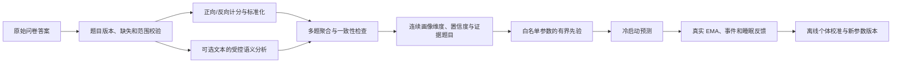
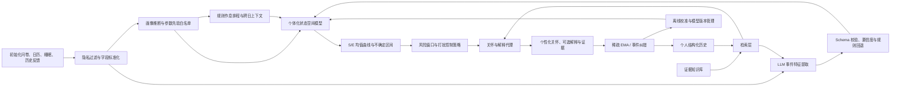

# 心理压力曲线项目机制审核、优化与智能化路线

---

## 0. 执行摘要

当前项目已经不是一个简单的规则打分器，而是一个“规则事件模型 + 压力/精力双状态 + 随机区制 + 微观缓冲池 + 告警 + 反馈校准”的混合仿真系统。它有较强的工程可解释性，但现阶段的主要矛盾不是机制不足，而是：

1. **机制和参数数量远大于可用真实反馈量，模型不可辨识。** 当前校准数据库只有 1 条日反馈、0 条事件反馈、0 次模型运行记录和 0 次校准任务，无法证明几十个机制与参数各自有效。
2. **部分机制的心理学含义强，但观测证据弱。** 例如随机 `FLOW/FRICTION` 跳变、顿悟返还、多巴胺池、EPOC 泛化、双层动量和每日抗压阈值演进，容易使曲线“看起来丰富”，却很难通过用户自评区分每个机制的独立贡献。
3. **曲线应作为内部计算骨架，而不是必须展示给用户的产品结果。** 不能要求 288 个五分钟点都有“绝对真值”；系统真正需要的是从内部状态轨迹中提前识别趋势、风险时间窗和适合关怀的时机。
4. **大模型适合做语义理解、检索与解释，不适合直接生成 288 个压力数值。** 推荐“LLM/RAG 特征提取 + 概率状态空间模型 + 规则安全约束”的混合架构。
5. **论文最有价值的贡献不是继续堆机制，而是做机制消融、稀疏反馈下的个性化曲线估计，以及规则、LLM、RAG 三种事件表征的可验证比较。**

建议将系统收敛为：

> 初始化问卷与历史上下文 → 日程语义结构化 → 个体化压力/精力状态预测 → 提前识别风险时间窗 → 在合适时机提供有证据、符合用户偏好的个性化关怀 → 用后续反馈继续校准。

内部仍然可以计算压力/精力曲线及不确定区间，用于风险判断、研究评价和模型消融；普通用户界面可以不展示完整曲线，只展示必要的趋势提示、关怀消息和可选解释。

### 0.1 本轮已确认的产品与研究决策

以下内容作为后续实现的当前基线：

1. 保留事件策略架构，但减少每个策略中的公式层级和自由参数；
2. 开展机制消融实验，用数据决定扩展机制是否重新启用；
3. 产品目标由“展示精细曲线”调整为“提前预测趋势、识别风险窗口并提供个性化关怀”；
4. 首次使用时通过简短问卷初始化睡眠、时段偏好、压力敏感度和恢复特征；
5. 引入跨日上下文，至少使用前一天的高压状态、重要事件、睡眠和近期反馈辅助次日预测；
6. Agent 负责语义理解、上下文组织、解释和关怀内容生成，RAG 负责知识与个人历史检索及证据链补充；
7. 增加特殊时点的压力/精力、峰值、事件影响和关怀效果反馈；
8. 摩擦压力池、顿悟返还、多巴胺池、半马尔可夫 `FLOW/FRICTION`、泊松异常跳变、双层压力动量、每日 `S*`/阈值自动演进均默认关闭，当前主版本不考虑；
9. 删除未进入主公式的配置键、兼容残留和确认无调用方的备用代码路径；
10. 自动三餐、午睡和睡眠预测保留，但必须由初始化问卷和后续历史反馈驱动，并明确标记为预测/插补数据；
11. 在编码优化前先确定统一的数据规范、Schema、版本和来源追踪方式。

---

## 1. 项目的整体立意与建议定位

### 1.1 当前项目实际做什么

主链路已经贯通：

1. 从飞书日历或模拟事件读取日程；
2. 用关键词和课程表把文本分类为课程、任务、运动、自习、就餐、午睡、睡眠或休息；
3. 自动补全睡眠、午餐、午睡和晚餐；
4. 每 5 分钟递推内部压力 `S(t)` 与精力 `E(t)`；
5. 叠加连续负荷、睡眠债、个体策略、半马尔可夫区制和微观缓冲机制；
6. 从内部曲线中提取趋势、风险窗口、告警理由和关怀时机；曲线图只作为研究、调试或用户主动查看的可选内容；
7. 提供日反馈、事件反馈、曲线评价和随机参数搜索接口。

项目已有的优势：

- 白盒公式多，便于解释和制作论文中的机制图；
- 压力与精力双变量比单压力分数更合理；
- 飞书日程接入、用户鉴权、API Key、SQLite、Docker 和健康检查已具备；
- 已有曲线评价、参数校验、模型版本表等研究基础设施；
- 事件级公式链和画像适合做可解释性展示。

### 1.2 建议的产品表述

推荐：

- “日程负荷与主观压力趋势估计”
- “基于日程和轻量反馈的压力风险提示与个性化关怀”
- “提前识别可能的高压时段，在合适时机提供低负担支持”

不推荐：

- “真实心理压力检测”
- “焦虑、抑郁或倦怠诊断”
- “精确预测用户每五分钟的心理状态”
- “医学级预警”

内部 `S/E` 最好称为“模型状态指数”，明确其量纲是项目自定义的。`PSS` 等量表可以用于外部效度检验，但不能直接当作某个五分钟时点的压力真值。经典 PSS 的原始研究将其作为总体感知压力测量工具，而不是连续时点传感器，参见 [Cohen 等人的 Perceived Stress Scale 原始论文](https://pubmed.ncbi.nlm.nih.gov/6668417/)。

用户侧的主输出建议限制为：

- “今天下午压力可能逐步上升”一类趋势提示；
- 预计风险时间窗及其主要原因；
- 一条简短、尊重用户偏好且可忽略的关怀；
- 用户主动展开后才展示证据、历史相似事件和更详细解释；
- 不展示具有虚假精确感的“五分钟压力为 73.6”等表述。

### 1.3 建议的核心研究问题

可将论文主问题收敛为：

> 在缺少连续心理真值、只有初始化问卷、日程、跨日上下文和少量反馈的条件下，能否通过可解释的动态模型提前识别个人压力趋势与风险时间窗；大模型语义理解、RAG 证据检索和个体历史能否改善预警质量与关怀时机？

这个问题比“预测每五分钟的真实压力值”更科学，也更容易设计实验和诚实陈述结论。

如果论文进一步主张“关怀减轻了压力”，则必须将“预测是否准确”和“关怀是否有效”拆成两个研究问题。前者可用预测指标评价；后者需要对照实验、微随机试验或其他因果设计，不能仅凭关怀后压力下降就宣称有效。

---

## 2. 审核发现：当前实现的关键事实

### 2.1 模型复杂度

当前模型同时包含：

- `S/E` 双状态；
- 课程 CIS、五类任务、运动、自习和四类恢复事件；
- 四种压力敏感策略、三种连续负荷策略；
- 四种日间休息策略、三种夜间恢复策略；
- 睡眠债、昼夜惩罚、习惯化、非稳态负荷；
- `NORMAL/FLOW/FRICTION` 半马尔可夫区制；
- 随机异常跳变；
- 能量缓冲、EPOC、摩擦压力池、多巴胺池、顿悟返还；
- 双层压力动量滤波；
- 瞬时水位与 AUC 式持续告警；
- `S*` 和抗压阈值的每日自动演进；
- 约 18 个参数的随机搜索校准空间。

这些机制单独都有可讲述性，但同时启用后会出现严重的等价解释问题。例如“课程后压力下降较慢”，既可能由恢复效率、焦虑休息策略、FRICTION 区制、动量滤波、睡眠债、低精力放大或微观池造成。只有少量反馈时，无法判断究竟是哪一个机制正确。

### 2.2 数据闭环尚未真正形成

当前数据库计数：

| 数据表 | 记录数 |
|---|---:|
| `daily_feedback` | 1 |
| `event_feedback` | 0 |
| `parameter_versions` | 0 |
| `model_runs` | 0 |
| `curve_points` | 0 |
| `evaluation_runs` | 0 |
| `calibration_jobs` | 0 |

虽然 API 已支持反馈和校准，但前端没有对应的日内反馈交互，`/api/simulate` 也没有把每次曲线和输入自动写入研究数据库。因此现在还不是“数据飞轮”，只是具备了部分接口。

### 2.3 当前校准不是文档构想中的梯度下降

实际的 `calibration/calibrator.py` 使用确定种子的随机搜索：

- 前期在参数范围内全局均匀采样；
- 后期围绕当前最优点缩小搜索半径；
- 默认同时搜索约 18 个参数；
- 默认约 60 次迭代；
- 目标函数由时点 MAE、趋势、峰值时间和告警分数组成。

该实现适合小型工程烟测，但在 1 个样本、18 个自由参数的情况下必然容易过拟合。现有 `info/improvements.md` 中提出的“梯度下降 + L2 正则”尚未真正落地，论文不能把构想写成已实现能力。

### 2.4 典型场景烟测

在同一日期、相同初始状态和默认例行事件下运行当前模型，得到：

| 场景 | 日终 S | 日终 E | S 峰值 | E 最低点 | 告警 |
|---|---:|---:|---|---|---:|
| 空日程 | 49.94 | 84.18 | 04:30 / 53.84 | 23:25 / 80.00 | 0 |
| 2 小时课程 | 49.97 | 84.05 | 10:55 / 56.69 | 11:00 / 67.52 | 0 |
| 2 小时 DDL 任务 | 52.28 | 80.94 | 15:55 / 56.63 | 17:35 / 70.85 | 0 |
| 1 小时健身 | 53.95 | 80.09 | 19:40 / 54.79 | 23:25 / 75.84 | 0 |
| 课程 + DDL + 健身 | 56.84 | 74.44 | 19:30 / 61.49 | 11:00 / 67.52 | 0 |
| 8 小时高压任务 | — | — | 15:55 / 87.88 | 15:55 / 10.66 | 0 |
| 15 小时高压任务 | — | — | 22:55 / 129.44 | 23:10 / 9.13 | 3 |

这只是工程诊断，不是效度证据，但暴露出三个问题：

1. 默认阈值为 100，普通场景几乎永远不会触发告警；
2. 8 小时高压任务已经使精力降至 10.66，仍没有告警，说明当前告警主要由压力接近阈值驱动，精力耗竭没有独立红线；
3. 自动补全的睡眠、午睡和三餐会明显影响空日程基线，因此“没有日程”和“没有压力源”并不等于纯自然衰减。

### 2.5 测试现状

- Python 编译检查通过；
- 当前 8 个自动化测试全部通过；
- 这 8 个测试集中在鉴权、用户、API Key、数据库备份和一次 API 仿真烟测；
- 核心曲线公式、事件分类、例行事件补全、随机可复现、参数灵敏度、校准和告警尚无系统回归测试。

因此只能说明当前 Web 鉴权主链可运行，不能说明心理曲线已经被验证。

---

## 3. 哪些机制应保留、简化、暂缓或删除

### 3.1 分层结论

| 层级 | 机制 | 建议 | 原因 |
|---|---|---|---|
| 核心 | 压力 `S` 与精力 `E` 双状态 | 保留 | 体现需求与资源的耦合，是项目最清晰的理论主线 |
| 核心 | 日程事件与事件策略 | 保留并减参 | 产品入口和论文可解释变量；保留课程、任务、运动、休息等差异，但统一计算接口 |
| 核心 | 个体基线、事件反应、恢复、累积负荷 | 保留 | 足以表达峰值、恢复和 pile-up |
| 核心 | 初始化画像问卷 | 新增 | 为冷启动提供睡眠、时段偏好、压力敏感和关怀偏好先验 |
| 核心 | 跨日上下文 | 新增 | 前日高压、睡眠、重要事件和近期残差会影响次日预测 |
| 核心 | 睡眠时长/质量 | 保留，问卷冷启动后持续校准 | 睡眠是重要上下文，可根据一般作息预测，但必须标记来源 |
| 核心 | 稀疏日内自评和事件反馈 | 必须补齐 | 是曲线校准和论文评价的观测依据 |
| 简化 | 四种 `f_strategy` | 保留策略语义，底层改为连续分数 | 问卷可初始化压力敏感度，避免硬编码人格组合 |
| 简化 | 四种休息策略、三种夜间策略 | 保留策略接口，压缩为少量恢复参数 | 继续表达个体差异，但减少手写分段公式 |
| 简化 | CIS 与任务类别 | 保留事件类型，统一特征与公式骨架 | 课程、任务仍有不同语义，但共享“强度 × 个体敏感 × 上下文”链路 |
| 简化 | 双引擎告警 | 保留框架，重做阈值和标签 | 当前“置信度”不是统计置信度，且精力耗竭未独立告警 |
| 可选 | 连续负荷和习惯化 | 先保留 | 具有清晰方向，可通过事件前后反馈做消融 |
| 可选 | 非稳态负荷 | 先保留一个有界交互项 | `E` 低时压力反应变强方向合理，但无需多层放大 |
| 可选 | EPOC | 仅作为运动延迟效应候选 | 不应泛化为餐食/午睡的“化学池”，需消融验证 |
| 关闭 | 半马尔可夫 `FLOW/FRICTION` | 默认关闭，当前主版本不考虑 | 无直接区制标签，参数难辨识，随机跳变降低可复现解释 |
| 关闭 | 泊松异常跳变 | 默认关闭，当前主版本不考虑 | 当前 `0.01` 是工程常数，不是从异常事件数据估计的发生率 |
| 关闭 | 摩擦压力池、顿悟返还、多巴胺池 | 默认关闭，后续清理主链依赖 | 生理命名过强，缺少观测依据，容易造成伪科学印象 |
| 关闭 | 双层压力动量 | 不再改变模型状态 | 若研究图需要平滑，只在可视化副本上处理 |
| 关闭 | 每日 `S*`/阈值自动演进 | 删除自动更新入口 | 个体变化应由真实反馈和显式参数版本更新 |
| 条件保留 | 自动三餐、午睡、睡眠补全 | 由初始化问卷和历史上下文驱动 | 项目是事前预测，不能依赖当天追问；所有预测事件必须带来源和置信度 |
| 删除 | 未进入主公式的配置键和兼容残留 | 清理 | 增加调参错觉、维护成本和论文描述负担 |
| 删除 | 未使用的备用代码路径 | 评估后移除 | `EventBus`、部分本地缓存、重复编排入口和工厂函数会制造架构噪声 |

### 3.2 已确认默认关闭的机制

建议在下一轮实现中用统一特性开关先切断主链，待回归测试稳定后再删除无复用价值的代码：

```json
{
  "enable_regime_switching": false,
  "enable_poisson_anomaly": false,
  "enable_friction_pool": false,
  "enable_epiphany_refund": false,
  "enable_dopamine_buffer": false,
  "enable_stress_momentum": false,
  "enable_daily_baseline_evolution": false
}
```

关闭机制后需要保留一份旧模型版本，以便论文消融和历史结果回放；但生产默认模型不得再经过这些分支。

#### A. 顿悟、多巴胺、摩擦压力返还

当前实现把 `FRICTION → FLOW` 的区制跳变解释为顿悟，并将累积压力转入多巴胺池，随后自动减压和恢复精力。这一机制的问题不是“绝对不可能”，而是：

- 没有可观测的顿悟标签；
- 跳变本身由启发式概率产生；
- 多巴胺无法从当前日程和自评中被识别；
- 它与普通恢复、心流、运动恢复和曲线滤波高度混淆；
- 生理术语容易使读者误以为系统测量了真实神经递质。

当前决定为默认关闭。若未来消融实验重新引入，应改为中性的“未观测正向冲击”实验项，并只在用户主动标记“问题解决/收到好消息”后触发。

#### B. 默认启用的半马尔可夫随机区制

区制模型本身可以成为后续研究方向，但当前没有 `FLOW/FRICTION` 真实标签，转移概率、Weibull 形状、事件护盾和异常概率均为手工设定。它会让同一事件影响被二次缩放，也会增加论文复现和归因难度。

第一篇论文不把它作为主模型；旧实现仅保留为扩展消融基线。

#### C. 每日自动演进 `S*` 和抗压阈值

当前 `/api/simulate` 每次成功仿真后都会根据仿真曲线均值和告警更新用户基线及阈值，并保存到用户档案。这样存在：

- 重复请求同一天会重复改变参数，接口不是幂等的；
- 运行“如果今天有一场考试”的沙盒也可能改变真实用户档案；
- 基线变化依赖模型自己的预测而非用户观测，会产生自我强化；
- 历史回放会影响未来状态，论文难以复现。

当前决定为关闭自动演进。更好的方式是把基线作为状态空间模型中的慢变量，由真实观测联合估计，并通过新的参数版本显式生效。

#### D. 问卷驱动的例行事件预测

自动三餐、午睡和睡眠对事前预测有实际价值，因此保留当前 `RoutineWeaver` 类似的“规则排程器”思路；问题在于当前主要使用全局默认作息，空日程也会固定产生 0.5 小时睡眠债和午睡，无法反映个体差异。

建议：

- 首次问卷采集一般入睡/起床时间、作息波动、午睡习惯、通常用餐窗口和周末差异；
- 预测次日时直接使用已经建立的个体画像作为默认窗口，不要求当天再次询问；
- 再读取当天真实日历，把课程、任务等不可移动事件转换成占用区间；
- 如果默认用餐或午睡时间被占用，在用户允许的窗口内按规则顺延、提前或缩短；
- 搜索候选时间时必须满足最小时长、事件前后缓冲和不重叠约束；
- 如果整个允许窗口都被课程或任务占满，则不插入虚构事件，而是记录 `missed` 或 `unavailable`，作为压力/精力预测的负向上下文；
- 后续通过睡前或次日反馈修正实际睡眠和例行事件，渐进更新画像；
- 所有自动事件标记 `source=questionnaire_imputed` 或 `source=history_imputed`，并记录 `confidence`；
- 每次自动排程记录原始理想窗口、最终安排、调整原因和未安排原因，保证解释和论文回放；
- 插补事件可以进入预测，但不能被当作真实训练标签；
- 论文主分析报告“仅日历事件”“日历 + 问卷插补”“日历 + 历史上下文”三组消融结果。

推荐的确定性排程顺序：

1. 从问卷画像读取个人理想时间和允许浮动窗口；
2. 合并当天日历占用区间；
3. 优先保留最小时长完整的候选时间；
4. 在候选时间中按“距离理想时间、可用时长、前后缓冲”评分；
5. 选出最高分时间并标记为预测事件；
6. 没有合法候选时生成一条未满足例行需求记录，不创建重叠事件。

例如用户通常 12:00 吃午饭，但 12:00–12:50 有课，系统可以在允许的午餐窗口中顺延到 12:50 以后；若整个午餐窗口均被占满，则输出“预计午餐未能正常安排”，并让模型考虑精力恢复缺失，而不是把午餐叠加到课程上。

#### E. 离散人格策略组合

事件和恢复策略的领域结构可以保留，但不再让用户被硬分配到 144 种固定组合。问卷中的 1–5 分、选择题和文本答案先被解释为少量连续画像维度，再映射为模型参数的**有界先验**，而不是把某个答案直接写入某个公式系数。

冷启动阶段优先保留：

- 基线压力与基线精力先验；
- 事件反应倾向；
- 恢复倾向；
- 跨日延续倾向；
- 睡眠不足敏感度；
- 时间偏好及少数事件维度敏感度。

最终数值模型仍只开放约 4–6 个可校准个体参数。`noise_scale`、告警阈值、事件群体基础强度等无法由自我描述可靠确定的量，不允许由问卷直接赋值，应由真实反馈和群体数据估计。

### 3.3 事件策略保留后的公式收敛原则

课程、任务、运动、休息等事件仍使用不同策略类，但都遵循同一骨架：

$$
\Delta \mathbf{z}_t
=
g_{\text{event}}\left(
\text{事件强度},
\text{持续时间},
\text{个体敏感度},
\text{精力与睡眠上下文}
\right)
$$

每个事件策略建议只保留：

- 1 个基础强度参数；
- 1 个个体敏感度交互参数；
- 1 个持续时间/习惯化参数；
- 必要时增加 1 个恢复或耗能参数；
- 一个有明确范围的噪声或不确定度参数。

不再为每个事件重复实现睡眠债、昼夜、恢复和滤波链路，这些应由共享上下文层统一处理。主模型的可调参数总量先控制在约 10–15 个，单用户开放校准的参数控制在 4–6 个。

### 3.4 如何说明“某机制无必要”

论文和答辩中不要说“该心理机制不存在”，而应使用以下逻辑：

> 该机制在理论上可能存在，但在当前输入与观测频率下不可辨识；加入后未在时间外验证、个体外验证或消融实验中带来稳定收益，却增加了参数量、方差和解释成本，因此本研究根据简约原则不将其纳入主模型，仅作为后续扩展。

判断一个机制是否必要，建议同时满足：

1. 有明确、可引用的理论方向；
2. 有与该机制对应的输入或观测；
3. 参数可以由现有数据估计；
4. 消融后性能明显变差；
5. 在不同日期和用户上增益稳定；
6. 不破坏概率校准和可解释性；
7. 增益超过额外复杂度与上线风险。

可以用下式表达模型选择：

$$
\text{Score}(M)
=
\text{ValidationLoss}(M)
+ \lambda_k \cdot \text{Complexity}(M)
+ \lambda_u \cdot \text{UncalibratedRisk}(M)
$$

主模型选择验证误差低且复杂度较小者，而不是选择曲线最“有戏剧性”的模型。

---

## 4. 主观压力曲线应该如何优化与评价

### 4.1 不应追求 288 个点的逐点真值

压力是潜变量，用户自评也是带噪声的观测。更合理的表述是：

$$
\mathbf{z}_t =
\begin{bmatrix}
S_t\\
E_t
\end{bmatrix}
,\qquad
\mathbf{y}_{t_k} = H\mathbf{z}_{t_k}+\boldsymbol{\eta}_{t_k}
$$

- `z_t`：系统希望估计的连续状态；
- `y_tk`：用户在少数时刻提交的压力/精力自评；
- `η`：主观量表、回忆偏差和环境造成的观测误差。

因此预测服务内部应输出：

- 预测均值曲线；
- 50%/90% 不确定区间；
- 有用户反馈的锚点；
- 哪些区间主要依赖插补或模型先验；
- 峰值、恢复、持续负荷等可解释摘要。

这些内容用于模型计算、风险窗口识别、离线评价和论文研究，不要求全部呈现在普通用户界面。用户侧默认只需要看到：

- 未来数小时的趋势等级；
- 预计高风险时间窗；
- 触发判断的主要可理解因素；
- 一条可忽略、不过度打扰的关怀；
- “为什么这样提醒我”的可选证据入口。

EMA 研究表明，压力报告会受“测量的是压力源还是主观压力、一天中的时间、工作日/周末”等因素影响；这进一步说明稀疏观测必须带上下文，参见 [五项 EMA 研究的协调分析](https://pmc.ncbi.nlm.nih.gov/articles/PMC6526071/)。关于压力反应、恢复与事件堆积的日内刻画，可参考 [Smyth 等人的实时压力反应研究](https://pmc.ncbi.nlm.nih.gov/articles/PMC11636429/)。

### 4.2 初始化个性化问卷

问卷的目标不是诊断人格，而是为冷启动模型提供可量化先验。建议控制在 2–4 分钟，并允许用户以后修改。

#### A. 作息与恢复

- 工作日通常入睡时间；
- 工作日通常起床时间；
- 周末相对工作日的偏移；
- 入睡/起床时间的常见波动范围；
- 是否午睡、通常午睡窗口和时长；
- 午餐与晚餐的一般时间窗口；
- 自评睡眠恢复感，0–10 分。

#### B. 时间与事件偏好

- 对早晨、上午、下午、晚间课程或任务的偏好，统一使用 1–5 分；
- 对考试、截止任务、公开汇报、社交会议、独立学习的主观压力敏感度，0–10 分；
- 对运动、独处、音乐、短休息等恢复方式的偏好，0–10 分；
- 对临时变化和不可控事件的敏感度，0–10 分。

#### C. 基线状态

- 最近一周通常压力水平，0–10 分；
- 最近一周通常精力水平，0–10 分；
- 压力上升速度自评，0–10 分；
- 压力发生后恢复速度自评，0–10 分；
- 是否容易因前一天事件影响第二天，0–10 分。

#### D. 关怀偏好

- 是否愿意接收预测性关怀；
- 可接收时段和绝对静默时段；
- 每日最多提醒次数；
- 喜欢的语气：简短、温和、理性、行动导向；
- 偏好的支持形式：呼吸、短休息、任务拆分、提前准备、联系朋友、只做情绪确认；
- 是否允许在解释中引用过去相似事件；
- 是否允许外部大模型处理脱敏后的事件文本。

问卷答案不直接等同于最终模型参数。系统应保存原始答案和问卷版本，再生成一份独立的 `profile_snapshot`。这样以后即使参数映射公式发生变化，也能基于原始答案重建画像。

问卷只负责初始化。随着实际反馈增加，系统应逐步降低问卷先验的权重，但不得静默篡改用户的原始回答。

#### E. 问卷答案到参数之间必须增加“画像推断层”

一个问题的答案为 1–5 分，只表示用户对该题陈述的选择强度，不天然等于压力反应系数、恢复速度或告警阈值。例如，对“临时改变计划会让我明显不安”选择 5，不能直接得到 `uncertainty_sensitivity=5`，更不能直接把公式中的某个乘数设为 1.5。

建议拆成三个可审计层级：

1. **原始回答层**：保存题目 ID、答案、量表范围、问卷版本和可选文本，不做覆盖；
2. **画像推断层**：用量表方向、反向题、跨题一致性、规则和受控语义分析得到潜在画像维度及置信度；
3. **参数先验层**：用版本化、可测试的确定性映射，把画像维度转换成少量参数的先验均值、范围和先验强度。

推荐流程如下：



对 1–5 分题，先按题目定义做标准化：

$$
x_q=\frac{r_q-r_{\min}}{r_{\max}-r_{\min}}
$$

反向题使用 `1-x_q`。一个画像维度由多道题而非单题决定：

$$
u_k=\frac{\sum_q w_qx_q+w_s s_{\text{semantic}}}{\sum_qw_q+w_s}
$$

其中 `s_semantic` 只来自经过 Schema 约束的文本语义标签；缺失、答案冲突或文本证据不足时，应降低置信度，而不是补出确定结论。随后再把画像分数映射为群体先验附近的有界个体先验：

$$
\theta_{i,k}\sim
\operatorname{TruncatedNormal}
\left(
\mu_k+\beta_k(u_{i,k}-0.5),
\sigma_k(c_{i,k})
\right)
$$

这里的 `μ`、`β`、上下界和置信度函数必须由专家审查、试点数据和消融实验确定并版本化。公式表达的是映射框架，不是现阶段已经确定的系数。

大模型在这一层只允许：

- 将开放文本归入预先定义的画像标签，如“社会评价敏感”“不可控变化敏感”“偏好行动导向关怀”；
- 找出支持该标签的最短证据片段；
- 输出置信度、矛盾提示和“无法判断”；
- 在题意含糊时辅助解释题目含义，但不能修改用户选择。

大模型不允许自由创造画像维度、直接输出最终模型参数、单凭文本推断诊断结果，或绕过白名单改变告警和安全策略。RAG 可以提供题目定义、构念说明和经过审定的映射依据，但线上检索结果不能临时改写参数公式；生产映射必须固定为 `mapping_version`。

这里的“语义分析”由两部分组成：固定选择题的题义在题库设计阶段预先标注，线上按确定性规则解释；只有开放文本、组合答案的矛盾说明或题义确实含糊时，才调用受控大模型。这样既实现“结合答案含义判断”，又避免同一组 1–5 分因为模型随机性得到不同参数。

#### F. 哪些内容应该受到问卷影响

需要区分“直接配置”和“模型参数先验”。事实性时间及用户明确偏好可以直接配置；心理动态参数只能经过画像推断后影响先验。

| 目标 | 问卷影响方式 | 建议强度 | 后续更新 |
|---|---|---:|---|
| 入睡、起床、用餐、午睡的理想时间与允许窗口 | 校验后直接写入作息配置 | 强 | 用户修改或历史规律修正 |
| 周末偏移、作息波动、静默时段、每日提醒上限 | 校验后直接写入配置 | 强 | 用户修改优先 |
| 关怀语气、支持方式、是否引用历史、外部 API 授权 | 作为明确偏好或权限直接配置 | 强 | 只能由用户授权变更 |
| 初始压力状态与初始精力状态 | 多题聚合后形成弱先验 | 弱 | 当日/近期真实反馈快速覆盖 |
| `event_reactivity` 事件反应程度 | 压力敏感、自评上升速度及事件题共同形成先验 | 中 | 事件前后反馈校准 |
| `recovery_rate` 恢复速度 | 恢复自评、睡眠恢复感和恢复方式偏好形成先验 | 弱至中 | 峰后反馈和恢复时间校准 |
| `carryover_strength` 跨日延续 | 前日影响自评及睡眠相关题形成先验 | 弱 | 连续多日数据校准 |
| `sleep_sensitivity` 睡眠不足影响 | 睡眠恢复感、缺觉体验等多题形成先验 | 弱至中 | 实际睡眠与次日状态校准 |
| `time_preference_vector` 时间偏好 | 早/中/晚偏好题聚合后用于作息排程和事件权重 | 中 | 日历纠错与时段反馈更新 |
| `event_sensitivity_vector` 事件维度敏感度 | 截止期限、社会评价、不确定性、认知负荷等多题和文本形成分组先验 | 中 | 相似事件历史反馈更新 |
| 关怀接受度 | 只影响内容和打扰控制，不进入压力动力学公式 | 强 | 关怀反馈更新 |

第一版建议把数值模型的问卷白名单明确收敛为两类：

- **两个初始状态先验**：`initial_stress_state`、`initial_energy_state`；
- **四个可个体化动力学参数先验**：`event_reactivity`、`recovery_rate`、`carryover_strength`、`sleep_sensitivity`。

`time_preference_vector` 和 `event_sensitivity_vector` 第一版先作为输入特征或群体系数的调节量，不作为任意可调自由参数；只有数据证明其稳定有效时，才升格为独立个体参数。这样既保留问卷个性化价值，又把真正进入数值模型的冷启动自由度控制在可解释范围内。

#### G. 不应由问卷直接影响的参数

以下内容应保持群体估计、反馈校准或系统固定：

- 个人风险告警阈值：必须用真实风险标签和漏报/误报成本校准，问卷不能单独决定；
- 观测噪声、过程噪声和随机扰动尺度：由重复观测残差估计；
- 各类事件的群体基础强度：由总体数据和专家范围确定；
- 低精力放大、习惯化等高阶交互项：只有纵向反馈充分后才考虑个体化；
- 时间步长、积分方法、状态上下界、数值裁剪和随机种子；
- 安全红线、危机处理、静默保护的系统下限以及 RAG 安全过滤；
- 已关闭机制的功能开关、模型版本和 Schema 版本。

因此，第一版不能采用“Q1=4，所以参数 A=0.8”这类单题直连。允许的例外只有明确事实和偏好，例如用户填写“通常 12:00 午餐”，它可以成为排程理想时间；但发生课程冲突时仍由确定性规则顺延、缩短或记录 `unavailable`。

#### H. 画像推断的质量控制

- 每个画像维度至少由 2 道题或“1 道题 + 明确文本证据”支持；
- 题库保存 `construct`、`polarity`、`weight`、适用版本和依据；
- 对反向题矛盾、极短作答、全选同一项和缺失过多做质量标记；
- 低置信度维度回退到群体先验，不强行个性化；
- 每个参数先验保留来源题目、规则轨迹、语义模型、提示词和映射版本；
- 用户修改回答后新建画像快照，历史预测仍引用旧快照；
- 真实反馈足够后只生成新的参数版本，不反向改写问卷画像；
- 涉及外部大模型时只发送必要且脱敏的题目文本，并遵守用户授权。

### 4.3 推荐的反馈采集

尽量降低负担，先采用：

- 起床后：当前压力 0–10、精力 0–10、睡眠质量 0–10；
- 午间或随机一次：当前压力和精力；
- 睡前：当前压力和精力、今日总体压力、今日最强压力事件；
- 关键事件结束后 10–30 分钟：只问一次“事件带来的压力/耗能有多大”；
- 预测峰值或高风险窗口结束后：询问实际峰值、峰值大致时间及系统是否提前预警；
- 发送关怀后：只采集“有帮助/一般/无帮助/打扰到我”以及可选的压力变化；
- 每周：使用一个经过授权和规范实施的总体量表作为外部效度，不把它硬映射到五分钟曲线。

每个反馈应同时记录：

- 实际填写时刻；
- 反馈对应的回顾窗口；
- 是否刚发生重要事件；
- 用户是否认为系统事件分类正确；
- 是否发生日历外意外事件；
- 当时是否看到了关怀以及是否采取了建议；
- 缺失原因或“稍后填写”标记。

EMA 通常在自然环境中每天多次、持续数周收集，状态空间方法能够处理观测依赖、缺失以及个体内/个体间差异，参见 [EMA 状态空间模型方法建议](https://arxiv.org/abs/2305.03214)。

### 4.4 曲线、预警与关怀评价指标

不再只看 288 点 MSE，建议分层评价：

| 评价对象 | 指标 | 解释 |
|---|---|---|
| 锚点数值 | MAE、RMSE | 反馈时点的压力/精力误差 |
| 相对变化 | 趋势方向准确率 | 上升、平稳、下降是否一致 |
| 峰值 | 峰值时间误差、峰值等级误差 | 是否抓住最难受的时间段 |
| 事件反应 | 事件前后增量误差 | 日程事件是否产生合理反应 |
| 恢复 | 恢复半衰时间误差 | 事件后多久回到个人基线附近 |
| 累积 | 基线上方 AUC | 是否反映持续承压而不只看峰值 |
| 告警 | 灵敏度、特异度、F1、PR-AUC | 是否漏报或频繁误报 |
| 提前量 | 命中预警的平均 lead time | 是否在峰值前给出足够但不过早的提醒 |
| 关怀触达 | 展示率、阅读率、忽略率 | 提醒是否真正到达且未过度打扰 |
| 主观帮助 | helpfulness、打扰率 | 用户是否认为关怀合适 |
| 关怀效果 | 对照条件下的压力变化 | 必须用因果设计评估，不能只看前后差 |
| 概率 | 区间覆盖率、NLL、CRPS | 不确定区间是否可信 |
| 个性化 | 个体内提升、冷启动提升 | 相对全局模型是否真正改善 |
| 稳定性 | 时间外、用户外验证 | 是否只记住了训练日期或用户 |

建议保留当前 `stress_mae`、`energy_mae`、趋势和峰值指标，但需要：

- 将压力量纲统一；当前模型 `S` 可到 150，而反馈被归一化到 0–100；
- 明确损失权重的来源，并做权重敏感性分析；
- 加入不确定区间评价；
- 将“告警置信度”改名为“风险积累指数”，除非它经过概率校准。

### 4.5 推荐的简化动态模型

第一阶段可以使用带个体随机效应的线性/非线性状态空间模型：

$$
\mathbf{z}_{i,t+1}
=
A_i\mathbf{z}_{i,t}
+ B_i\boldsymbol{\phi}(event_{i,t})
+ C\mathbf{c}_{i,t}
+ \boldsymbol{\epsilon}_{i,t}
$$

其中：

- `φ(event)`：事件负荷、社会评价、可控性、喜欢程度、持续时间等结构化特征；
- `c_t`：睡眠、时间段、连续负荷、是否休息等上下文；
- `A_i`：个人惯性和恢复；
- `B_i`：个人事件敏感度；
- `ε_t`：日历无法解释的扰动。

推荐从卡尔曼滤波/扩展卡尔曼滤波、层级贝叶斯状态空间模型或简单动态混合效应模型开始。数据量不足时，不要首先使用大规模神经网络。

### 4.6 参数优化顺序

建议分三层，禁止一次搜索几十个参数：

1. **固定层**：时间步、量纲范围、输出约束、观测定义；
2. **群体层**：全体用户共同估计的事件类别先验、睡眠效应、昼夜项；
3. **个体层**：只开放基线、反应、恢复、疲劳交互等 4–6 个参数。

采用滚动时间切分：

- 前 14 天训练；
- 后 7 天验证；
- 再滚动窗口；
- 绝不随机打乱同一用户的时间点。

同时做“留一用户验证”，区分：

- 冷启动泛化；
- 同一用户的个性化提升；
- 是否只对少数高频用户有效。

### 4.7 跨日上下文建模

次日预测不能只看次日日历。建议生成一个版本化的 `daily_context_snapshot`，默认使用前 1 天强上下文和前 7 天弱历史统计：

- 前一日最终压力/精力的概率分布，而非单一确定值；
- 前一日是否出现高风险窗口、峰值和持续承压；
- 前一日实际睡眠、预计睡眠债及睡眠质量；
- 前一日最重要事件及其语义特征；
- 尚未结束或会延续到次日的任务；
- 最近 7 天的个人基线、平均残差和恢复速度；
- 最近关怀是否被阅读、是否有帮助、是否造成打扰；
- 次日日历事件与历史相似事件的检索摘要。

可在状态转移中增加跨日项：

$$
\mathbf{z}_{d,0}
=
G\mathbf{z}_{d-1,\text{end}}
+ H\mathbf{q}_{d-1}
+ J\mathbf{h}_{d-7:d-1}
+ \boldsymbol{\epsilon}_{d}
$$

其中 `q` 是前一日重要事件、睡眠与告警摘要，`h` 是近期历史统计。Agent 可以负责把前一日重要事件整理成结构化语义特征，但不得把无限长度的聊天或日历原文直接拼入每次预测。

上下文应区分：

- `observed`：用户真实反馈或真实日历；
- `questionnaire_imputed`：问卷推测的作息；
- `history_imputed`：历史习惯推测；
- `llm_derived`：大模型语义结构化结果；
- `model_derived`：模型状态或风险摘要。

不同来源进入预测时应使用不同置信度，避免把模型自己的输出循环当成事实。

### 4.8 关怀触发策略

关怀是否发送必须由确定的风险与打扰控制策略决定，而不是由大模型自由决定。推荐条件：

1. 风险窗口的发生概率超过已校准阈值；
2. 距预计峰值有合理提前量；
3. 当前不在用户静默时段；
4. 距上次提醒超过冷却时间；
5. 当日提醒次数未超过用户上限；
6. 用户未关闭该类型关怀；
7. 关怀内容通过安全规则和证据检查。

大模型只在触发后根据用户偏好、事件语义和检索证据生成措辞。触发记录、候选内容、最终内容、证据、发送时间和用户反馈均应持久化，以便评估“何时提醒”和“说什么”两个不同问题。

---

## 5. Agent、大模型 API、RAG 应该如何引入

### 5.1 核心原则

建议让大模型承担它擅长的任务：

- 理解含糊日程文本；
- 把自然语言转换成严格结构化特征；
- 结合前一天重要事件和近期相似历史组织跨日上下文；
- 检索并引用知识库；
- 根据模型结果和用户偏好生成可读解释与人性化关怀；
- 在模型不确定性高时选择最有价值的反馈问题。

不建议让大模型：

- 直接输出全天 288 个压力值；
- 每次请求临时发明参数；
- 绕过数值模型直接给出红黄橙告警；
- 自由决定是否发送提醒、发送频率或静默时段；
- 根据一段文本诊断心理疾病；
- 无引用地生成心理学机制或干预建议。

### 5.2 推荐架构



### 5.3 LLM 事件特征提取

大模型返回严格 JSON，而不是自由文本：

```json
{
  "event_type": "task",
  "task_subtype": "presentation",
  "cognitive_load": 0.78,
  "social_evaluation": 0.92,
  "controllability": 0.40,
  "time_pressure": 0.80,
  "valence": -0.35,
  "expected_recovery": "slow",
  "confidence": 0.81,
  "evidence_spans": ["毕业答辩", "最终汇报"]
}
```

然后执行：

1. JSON Schema 校验；
2. 范围裁剪；
3. 低置信度时回退到现有关键词规则；
4. 用户纠错后写入事件反馈；
5. 保存模型名称、提示词版本、检索文档 ID 和响应摘要；
6. 相同事件文本做缓存，控制成本和结果漂移。

事件语义不仅服务于数值预测，也服务于关怀内容。例如“下午有公开答辩”和“下午独立整理资料”可能具有相似认知负荷，但前者的社会评价和不可控性更高，关怀的措辞与建议应不同。

大模型带来的主要价值应通过以下对照验证：

- 规则分类；
- 纯 LLM 分类；
- LLM + RAG；
- LLM + RAG + 用户历史；
- 人工标注上限。

### 5.4 RAG 知识库设计

RAG 不是“把论文塞进向量库后直接预测压力”，而是给语义判断和解释提供可追溯上下文。RAG 的原始思想是把参数化模型与可检索的非参数化知识结合，以改善知识密集任务的事实性和来源追踪，参见 [Lewis 等人的 NeurIPS 2020 RAG 论文](https://papers.nips.cc/paper/2020/hash/6b493230205f780e1bc26945df7481e5-Abstract.html)。

建议分三个库：

#### A. 证据知识库

- 同行评审论文；
- EMA 与压力测量方法；
- 合法获得的量表说明；
- 专家审定的机制和参数范围；
- 每条文档包含来源、年份、适用人群、证据等级和限制。

用途：事件特征定义、解释、研究引用。不能把文献中的群体平均效应直接当作某位用户的确定参数。

#### B. 用户结构化历史库

- 日期；
- 当日开始/结束状态与风险窗口；
- 事件结构化特征；
- 事件前后自评；
- 睡眠与恢复反馈；
- 自动作息排程结果及未满足的例行需求；
- 已发送关怀、用户是否阅读及帮助程度；
- 模型预测、残差和用户纠错；
- 个人参数版本。

用途：检索“过去相似事件对该用户的实际影响”和“过去哪类关怀更适合该用户”。优先用结构化检索和数值统计，只有确实需要时才对经脱敏的短文本做向量检索。

#### C. 系统知识库

- 模型卡；
- 参数定义；
- 版本变更；
- 已知限制；
- 告警和解释模板；
- 经审核的关怀策略、适用条件和禁用条件；
- 禁止性表述。

用途：确保解释代理知道当前运行的是哪个模型，避免把旧公式或构想误说成现状。

### 5.5 关怀内容与证据链

一条关怀应由三类证据共同形成，但三者不能混为一谈：

1. **预测证据**：风险窗口、概率、预计峰值和主要影响因子，来自数值模型；
2. **个人证据**：过去相似事件的实际反馈、有效关怀偏好和作息习惯，来自个人结构化历史；
3. **知识证据**：经过审核的低风险支持方法及其适用限制，来自公共证据知识库。

建议的生成顺序：

1. 风险策略先决定“是否应该关怀”；
2. 结构化历史检索决定“用户过去更接受什么”；
3. 证据库检索决定“可以提供哪些有依据且低风险的支持”；
4. 大模型把三类信息组织成符合用户语气偏好的短消息；
5. 安全规则删除诊断、保证效果、责备用户或不合时宜的内容；
6. 保存预测依据、历史记录 ID、文献切片 ID 和最终消息之间的对应关系。

关怀默认应包含：

- 对当前处境的简短承认；
- 一个非常低负担、可以立即执行的选择；
- “不方便也可以忽略”的自主性表达；
- 必要时提供“为什么这样建议”的可展开证据。

不应包含：

- “你现在一定非常焦虑”等确定化判断；
- 疾病、诊断或药物结论；
- “这样做一定能缓解”等效果保证；
- 大段论文式说教；
- 在用户静默时段、密集课程中或刚忽略提醒后重复推送。

### 5.6 是否需要多 Agent

第一版不需要复杂的多 Agent 自主协作。一个受控编排器调用几个明确工具更可靠：

- **事件理解工具**：结构化日程；
- **相似历史检索工具**：返回过去相似事件的统计；
- **曲线模型工具**：纯确定/概率数值计算；
- **关怀策略工具**：根据风险、静默时段、冷却时间和提醒上限判断是否允许发送；
- **解释与关怀工具**：只读模型输出、用户偏好与检索证据，生成候选措辞；
- **安全检查工具**：检查诊断化、确定化和高风险措辞。

后续可以引入四个逻辑角色，但仍应由固定工作流编排：

1. 事件理解代理；
2. 主动反馈代理：在高不确定区间选择最少问题；
3. 关怀与解释代理：引用证据和个人历史，并遵守用户语气偏好；
4. 安全代理：阻止诊断、过度承诺和不当建议。

真正有论文价值的 Agent 功能是“主动学习”：系统不频繁打扰用户，而是在最能降低参数不确定性的时刻询问一次。

### 5.7 大模型不能解决的问题

- 没有真实反馈时，大模型无法知道用户实际压力；
- RAG 只能提供群体知识和历史相似性，不能制造个人真值；
- API 模型升级会导致输出漂移，必须版本化；
- 同一段含糊日程可能有多种合理解释，必须显示置信度；
- 将健康相关文本发送给外部 API 会增加隐私和合规要求；
- 大模型解释更流畅不等于数值预测更准确。

因此大模型必须是“有界组件”，而不是整个模型的最终裁判。

---

## 6. 数据规范与 Schema 设计

### 6.1 统一规范

所有数据库记录、内部事件和 API 对象遵循以下规则：

- ID 使用 UUID，不能用事件名称或日期充当唯一键；
- 时间使用带时区的 ISO 8601，例如 `2026-07-30T12:50:00+08:00`；
- 同时保存 `local_date` 与 `timezone`，跨日状态以用户本地日期切分；
- 用户问卷评分统一采集为整数 `0–10` 或 `1–5`，字段中必须声明量表；
- 模型内部连续特征统一为 `[0,1]`，转换规则由 `mapping_version` 管理；
- 每个对象包含 `schema_version`；
- 每次预测包含 `model_version`、`parameter_version`、`feature_version`；
- LLM 结果包含 `provider`、`model`、`prompt_version` 和 `retrieval_record_id`；
- 任何插补或派生字段都必须记录 `source`、`confidence` 和 `provenance`；
- 原始记录不可静默覆盖，修正通过新版本或纠错记录表达；
- 用户文本、日历原文与用于建模的结构化特征分层保存；
- API 不返回数据库自增主键、密钥、token 或内部敏感路径。

统一来源枚举：

```text
observed
questionnaire
questionnaire_imputed
history_imputed
user_corrected
rule_derived
llm_derived
profile_derived
model_derived
system_default
```

数据质量状态：

```text
valid
missing
imputed
conflicting
user_rejected
expired
```

### 6.2 数据分层

| 层 | 内容 | 是否可直接训练 |
|---|---|---|
| 原始层 | 问卷原答、日历原文、用户反馈原答 | 经同意和清洗后使用 |
| 标准化层 | 统一时间、事件类型、量表和用户本地日期 | 可以 |
| 语义特征层 | 规则/LLM 提取的负荷、可控性、社会评价等 | 可以，但必须带版本 |
| 画像层 | 问卷构念分数、置信度和白名单参数先验 | 只能作为模型输入，不能当作真实标签 |
| 上下文层 | 前日状态、历史统计、作息排程和相似事件摘要 | 可以，但区分观测与派生 |
| 预测层 | 内部曲线、风险窗口、不确定区间和解释因子 | 不能当作真实标签 |
| 交互层 | 关怀触发、内容、触达、帮助程度和反馈 | 可用于关怀策略评估 |
| 知识层 | 文献、审定内容、切片、向量与检索记录 | 只用于检索和证据链 |

### 6.3 核心实体与关系

| 实体 | 主要用途 | 关键关联 |
|---|---|---|
| `users` | 账户与权限 | 关联所有用户数据 |
| `consent_records` | 知情同意和数据授权版本 | `user_id` |
| `questionnaire_definitions` | 版本化题目、构念、方向和映射白名单 | `questionnaire_version` |
| `questionnaire_responses` | 保存原始问卷答案 | `user_id`, `questionnaire_version` |
| `profile_inference_runs` | 记录规则与语义分析过程、证据和置信度 | `response_id`, `mapping_version` |
| `profile_snapshots` | 画像维度和白名单参数先验 | `profile_inference_run_id`, `mapping_version` |
| `calendar_events` | 标准化真实日程 | `user_id`, `local_date` |
| `event_semantics` | 规则/LLM 事件语义特征 | `event_id`, `feature_version` |
| `routine_plans` | 自动作息排程和未满足需求 | `user_id`, `local_date`, `profile_snapshot_id` |
| `daily_context_snapshots` | 跨日预测上下文 | `user_id`, `target_date` |
| `prediction_runs` | 一次完整预测及版本 | `context_snapshot_id`, `parameter_version` |
| `state_points` | 内部 S/E 均值与区间 | `prediction_run_id` |
| `risk_windows` | 由内部状态提取的风险时间窗 | `prediction_run_id` |
| `retrieval_records` | RAG 查询、命中文档和证据 | `prediction_run_id` 或 `care_action_id` |
| `care_actions` | 关怀触发、内容和发送结果 | `risk_window_id`, `retrieval_record_id` |
| `feedback_observations` | 时点、峰值、事件和关怀反馈 | `prediction_run_id`, 可选 `event_id/care_action_id` |
| `parameter_versions` | 可激活和可回滚参数 | `user_id`, `model_version` |
| `model_evaluations` | 时间外、用户外和消融评价 | `model_version`, `dataset_version` |

所有预测必须能够沿以下链条回溯：

> 关怀 → 风险窗口 → 预测运行 → 当日上下文 → 画像快照 → 画像推断运行 → 原始问卷/日历/历史 → 语义特征与 RAG 证据 → 模型和参数版本。

### 6.4 初始化问卷 Schema

题目定义与用户答案必须分开保存。题库中的题义、计分方向和目标构念示例：

```json
{
  "questionnaire_version": "2026-07-30.v1",
  "schema_version": "questionnaire_definition.v1",
  "questions": [
    {
      "question_id": "stress_change_01",
      "prompt": "临时改变计划会让我明显不安。",
      "response_type": "likert_1_5",
      "scale": {
        "min": 1,
        "max": 5
      },
      "construct_mappings": [
        {
          "construct": "uncertainty_sensitivity",
          "polarity": "forward",
          "weight": 0.6
        }
      ],
      "direct_config_target": null
    },
    {
      "question_id": "lunch_ideal_time",
      "prompt": "你通常希望几点吃午餐？",
      "response_type": "local_time",
      "construct_mappings": [],
      "direct_config_target": "routine.lunch_ideal_time"
    }
  ]
}
```

用户提交对象只保存事实性配置和原始题目答案：

```json
{
  "response_id": "uuid",
  "user_id": "uuid",
  "schema_version": "onboarding.v1",
  "questionnaire_version": "2026-07-30.v1",
  "submitted_at": "2026-07-30T09:00:00+08:00",
  "timezone": "Asia/Shanghai",
  "routine": {
    "weekday_sleep_start": "23:30",
    "weekday_wake_time": "07:30",
    "weekend_shift_minutes": 60,
    "schedule_variability_minutes": 30,
    "nap_frequency": "sometimes",
    "nap_window": ["12:20", "13:40"],
    "lunch_ideal_time": "12:00",
    "lunch_allowed_window": ["11:20", "13:40"],
    "dinner_ideal_time": "18:00",
    "dinner_allowed_window": ["17:00", "20:00"]
  },
  "item_responses": [
    {
      "question_id": "stress_change_01",
      "response_type": "likert_1_5",
      "value": 5
    },
    {
      "question_id": "adapt_change_reverse_01",
      "response_type": "likert_1_5",
      "value": 2
    },
    {
      "question_id": "recovery_speed_01",
      "response_type": "likert_1_5",
      "value": 2
    },
    {
      "question_id": "course_time_preference",
      "response_type": "matrix_likert_1_5",
      "value": {
        "morning": 2,
        "noon": 4,
        "afternoon": 5,
        "evening": 3
      }
    },
    {
      "question_id": "change_experience_text",
      "response_type": "optional_text",
      "value": "临时换课后，我通常需要很久才能重新进入状态。"
    }
  ],
  "care_preferences": {
    "enabled": true,
    "quiet_hours": ["23:00", "07:00"],
    "max_daily_messages": 2,
    "tone": "brief_warm",
    "preferred_support": ["task_breakdown", "short_break"],
    "allow_personal_history_reference": true,
    "allow_external_llm": false
  }
}
```

题目构念、正反向、权重和映射目标保存在版本化题库中，不复制到用户原始回答。一次画像推断应生成独立记录，例如：

```json
{
  "profile_inference_run_id": "uuid",
  "schema_version": "profile_inference.v1",
  "response_id": "uuid",
  "mapping_version": "profile_mapping.v1",
  "created_at": "2026-07-30T09:00:02+08:00",
  "semantic_processor": {
    "mode": "rules_plus_llm",
    "model": "local/model-version",
    "prompt_version": "questionnaire_semantics.v1"
  },
  "traits": [
    {
      "trait": "uncertainty_sensitivity",
      "score_0_1": 0.76,
      "confidence_0_1": 0.81,
      "evidence": [
        {
          "question_id": "stress_change_01",
          "normalized_value": 1.0,
          "role": "forward_item"
        },
        {
          "question_id": "adapt_change_reverse_01",
          "normalized_value": 0.75,
          "role": "reverse_item"
        },
        {
          "question_id": "change_experience_text",
          "semantic_label": "slow_reorientation_after_change",
          "role": "text_evidence"
        }
      ],
      "quality_flags": []
    }
  ],
  "parameter_priors": [
    {
      "parameter": "event_sensitivity.uncertainty",
      "mean": 1.18,
      "lower": 0.90,
      "upper": 1.35,
      "prior_strength": "medium",
      "source_traits": ["uncertainty_sensitivity"]
    }
  ],
  "global_quality": {
    "status": "valid",
    "missing_ratio": 0.0,
    "consistency_score_0_1": 0.84
  }
}
```

示例数值只用于说明 Schema，不是最终量表阈值或参数值。由推断生成的 `profile_snapshot` 另外保存：

- 连续画像维度及其置信度；
- 白名单参数的先验均值、上下界和先验强度；
- 每个画像和参数的证据题目及规则轨迹；
- `mapping_version`；
- 生成时间和失效时间；
- 后续反馈产生的调整，不覆盖原始问卷。

### 6.5 标准事件与语义 Schema

```json
{
  "event_id": "uuid",
  "user_id": "uuid",
  "schema_version": "event.v1",
  "source": "observed",
  "title": "毕业答辩",
  "description": "最终汇报与老师提问",
  "start_at": "2026-07-31T14:00:00+08:00",
  "end_at": "2026-07-31T15:30:00+08:00",
  "event_type": "task",
  "task_subtype": "presentation",
  "semantics": {
    "cognitive_load": 0.78,
    "social_evaluation": 0.92,
    "controllability": 0.40,
    "time_pressure": 0.80,
    "valence": -0.35
  },
  "derivation": {
    "source": "llm_derived",
    "confidence": 0.81,
    "feature_version": "event_semantics.v1",
    "model": "provider/model-version",
    "prompt_version": "event_extract.v1",
    "evidence_spans": ["毕业答辩", "最终汇报", "老师提问"]
  }
}
```

用户纠错不直接覆盖该记录，而是新增纠错记录并生成新的 `event_semantics` 版本。

### 6.6 自动作息排程 Schema

规则排程器需要同时输出成功安排和未满足需求：

```json
{
  "routine_plan_id": "uuid",
  "schema_version": "routine_plan.v1",
  "user_id": "uuid",
  "local_date": "2026-07-31",
  "profile_snapshot_id": "uuid",
  "rule_version": "routine_weaver.v2",
  "items": [
    {
      "routine_type": "lunch",
      "ideal_window": ["12:00", "12:30"],
      "allowed_window": ["11:20", "13:40"],
      "scheduled_window": ["12:50", "13:20"],
      "status": "shifted",
      "source": "questionnaire_imputed",
      "confidence": 0.86,
      "reason_codes": ["ideal_time_occupied_by_course"]
    },
    {
      "routine_type": "nap",
      "ideal_window": ["12:40", "13:20"],
      "allowed_window": ["12:20", "13:50"],
      "scheduled_window": null,
      "status": "unavailable",
      "source": "questionnaire_imputed",
      "confidence": 0.74,
      "reason_codes": ["allowed_window_fully_occupied"]
    }
  ]
}
```

允许的 `status`：

```text
scheduled
shifted
shortened
unavailable
not_expected
user_corrected
```

`unavailable` 不创建恢复事件，而是作为缺餐、缺休息或睡眠不足的上下文特征。

### 6.7 跨日上下文与预测 Schema

`daily_context_snapshot` 只保存预测所需的有限上下文：

```json
{
  "context_snapshot_id": "uuid",
  "schema_version": "daily_context.v1",
  "user_id": "uuid",
  "target_date": "2026-07-31",
  "created_at": "2026-07-30T22:30:00+08:00",
  "profile_snapshot_id": "uuid",
  "previous_day": {
    "end_stress_mean": 82.0,
    "end_stress_p90": 91.0,
    "end_energy_mean": 24.0,
    "peak_time": "21:10",
    "risk_level": "high",
    "sleep_quality_0_10": 3,
    "important_event_ids": ["uuid"]
  },
  "recent_7d": {
    "stress_baseline_mean": 54.0,
    "prediction_residual_mean": 6.2,
    "recovery_minutes_median": 95
  },
  "routine_plan_id": "uuid",
  "data_quality": {
    "observed_ratio": 0.63,
    "imputed_ratio": 0.37
  }
}
```

预测运行输出至少包含：

- 内部状态点及其区间；
- 风险窗口的开始、峰值和结束；
- 风险发生概率和已校准等级；
- 预计提前量；
- 主要影响因子及贡献方向；
- 数据质量和不确定性；
- 是否满足关怀触发条件。

### 6.8 关怀与反馈 Schema

`care_action` 必须区分“系统决定发送”和“LLM 生成措辞”：

```json
{
  "care_action_id": "uuid",
  "schema_version": "care_action.v1",
  "risk_window_id": "uuid",
  "policy_version": "care_policy.v1",
  "decision": "send",
  "decision_reasons": ["risk_probability_above_threshold", "lead_time_valid"],
  "scheduled_at": "2026-07-31T13:20:00+08:00",
  "message": "下午的答辩可能会让你比较紧绷。离开始还有一点时间，可以先把最担心的三个问题写下来，不必一次准备完。",
  "tone": "brief_warm",
  "retrieval_record_id": "uuid",
  "generator": {
    "source": "llm_derived",
    "model": "provider/model-version",
    "prompt_version": "care_message.v1"
  },
  "delivery": {
    "status": "delivered",
    "delivered_at": "2026-07-31T13:20:03+08:00"
  }
}
```

`feedback_observation` 统一支持：

- `momentary_state`：特殊时点压力/精力；
- `peak_review`：实际峰值和时间；
- `event_impact`：事件压力与耗能；
- `prediction_review`：预警是否准确；
- `care_review`：关怀是否有帮助或造成打扰；
- `routine_correction`：实际睡眠、用餐或午睡纠错。

所有反馈保存 `reported_at`、`target_time/window`、量表、关联运行、是否回顾性填写和缺失字段，避免把睡前回忆误当作实时观测。

### 6.9 RAG 证据链 Schema

每次关怀或解释调用至少保存：

- 脱敏后的查询摘要；
- 检索库版本和过滤条件；
- 命中文档 ID、切片 ID、相似度和重排分；
- 文档标题、来源、发布日期和证据等级；
- 哪条最终表述使用了哪个切片；
- 未采用的高分结果及原因；
- LLM 模型、提示词和生成时间。

知识文档必须经过审核后才能进入生产检索库。个人历史库和公共证据库分开授权、分开索引，禁止把其他用户历史当作当前用户的个性化证据。

---

## 7. 推荐的机制消融与论文实验

### 7.1 模型梯度

按由简到繁建立嵌套模型：

- `M0`：个人常数基线；
- `M1`：基线 + 事件即时反应 + 指数恢复；
- `M2`：`M1` + 精力和睡眠；
- `M3`：`M2` + 连续负荷/习惯化；
- `M4`：`M3` + 个体随机效应；
- `M4-context`：`M4` + 前一日与近 7 天上下文；
- `M4-routine`：`M4-context` + 问卷驱动的自动作息排程；
- `M5-rule`：规则事件特征；
- `M5-llm`：LLM 事件特征；
- `M5-rag`：LLM + 证据/个人历史 RAG；
- `M6-regime`：增加区制切换；
- `M7-micro`：增加 EPOC、缓冲等扩展机制。

只有当 `M6/M7` 在时间外验证中稳定优于 `M5`，并且区间校准没有变差时，才保留在最终论文主模型中。

### 7.2 主要假设

可以预注册以下假设：

- H1：日程事件模型优于仅个人基线；
- H2：加入睡眠与精力状态能改善峰值和恢复预测；
- H3：个体化参数优于统一参数；
- H4：LLM 结构化特征在人工事件标注和曲线预测上优于关键词规则；
- H5：RAG 主要改善分类一致性和解释可追溯性，对数值预测的增益需要实证检验；
- H6：复杂随机区制和微观池未必优于简化模型。
- H7：跨日上下文和问卷驱动的作息排程能改善风险窗口命中率与提前量；
- H8：满足个体偏好且在合适时间发送的关怀，比固定时间或通用关怀更少造成打扰；
- H9：关怀能否降低压力必须通过独立的因果实验检验。
- H10：相比单题直接赋参，基于多题规则、反向计分、一致性检查和受控语义分析的画像先验，能够改善冷启动预警并降低参数不稳定性。

H6 即使成立也是有价值的研究结论，因为它说明在稀疏主观观测下，简约模型更稳健。

画像初始化应单独做一组消融：

- `P0`：仅使用群体先验，不使用问卷个性化；
- `P1`：单题线性直连参数，仅作为对照，不作为上线方案；
- `P2`：多题确定性规则、反向计分和一致性检查；
- `P3`：`P2` + 开放文本的受控语义分析；
- `P4`：`P3` + 纵向反馈更新后的参数版本。

比较冷启动前 1–3 天、前 7 天以及反馈积累后的锚点误差、风险窗口 F1、提前量、概率校准、参数稳定性与个体内提升。若 `P3` 相对 `P2` 没有稳定收益，则问卷阶段不必调用大模型；语义分析仍可保留在日历事件和关怀内容中。

### 7.3 数据量建议

最低可行性研究：

- 20–30 名参与者；
- 连续 21 天；
- 每天 3 次固定/随机 EMA；
- 关键事件后最多 1 次额外反馈。

更稳妥的论文数据：

- 50 名以上参与者；
- 连续 28 天；
- 保证不同压力水平、周末/工作日和考试/非考试阶段；
- 预留完整参与者作为用户外测试集。

重点不是盲目追求总行数，而是每个用户有足够时间跨度、峰值事件和恢复片段。

### 7.4 论文可形成的贡献

1. 提出问卷画像、日程和跨日上下文驱动的双状态风险预测模型；
2. 用消融研究回答哪些专家机制真正必要；
3. 比较规则、LLM 与 RAG 的事件语义表征；
4. 提出从内部状态轨迹提取风险窗口和提前量的方法；
5. 提出带证据链、打扰控制和用户偏好的个性化关怀流程；
6. 提出个体历史检索与主动反馈的低负担个性化方法；
7. 提供上下文、预测、关怀、参数、提示词、知识库和评价的版本化复现实验框架。

推荐论文标题方向：

> 基于日程语义、跨日上下文与稀疏生态瞬时评估的个体化压力预警：规则、状态空间模型与检索增强大模型的比较研究

---

## 8. 上线前必须处理的问题

### 8.1 研究与模型问题

- 统一 `S` 的量纲；避免模型 `[0,150]`、反馈 `[0,100]` 混用；
- 模型输出必须带“不确定性”和“非诊断”说明；
- 建立算法黄金样例与单元测试；
- 用初始化问卷生成个体作息窗口，再由规则排程器避开真实日历冲突；
- 自动作息结果必须标记来源、置信度、调整原因或未安排原因；
- 禁止每次模拟自动更新基线；
- 保存每次运行的输入、曲线、参数版本和模型版本；
- 反馈必须与运行 ID 关联；
- 告警应独立考虑极低精力，并由真实标签校准；
- 随机模型必须重置状态并记录随机种子；
- 默认关闭本轮已确认停用的七类机制；
- 区分内部原始状态轨迹、风险窗口和仅用于研究的展示图；
- 建立关怀触发策略、静默时段、冷却时间和每日次数上限。

### 8.2 当前代码层面的上线风险

#### 飞书多用户隔离

当前用户账户和参数已按用户存储，但飞书 OAuth token、日历 ID 仍主要通过服务器文件和全局配置读取。多用户上线时可能出现：

- 不同账户共用同一飞书令牌；
- 某用户读取到服务器默认日历；
- token 文件被并发覆盖；
- 无法按用户撤销授权。

必须改为按应用用户保存加密后的飞书授权信息，并建立用户与飞书身份的明确绑定。

#### 模拟接口的副作用

`/api/simulate` 同时承担：

- 获取事件；
- 运行沙盒；
- 演进真实用户参数；
- 保存用户档案；
- 生成图片。

建议拆成：

- `POST /simulations`：只创建可复现仿真；
- `POST /onboarding-responses`：提交初始化问卷并生成画像；
- `POST /routine-plans`：基于画像和日历生成规则作息计划；
- `POST /predictions`：生成内部状态与风险窗口；
- `POST /daily-settlements`：用事后反馈结算真实一天；
- `POST /feedback`：绑定运行提交反馈；
- `POST /care-actions`：记录关怀决策、证据、生成和触达；
- `POST /calibrations`：离线生成候选参数版本；
- `POST /parameter-versions/{id}/activate`：审核后显式启用。

#### 数据存储

SQLite 适合小规模试点，但应至少：

- 合并或明确区分应用库与研究校准库；
- 加密备份；
- 设置数据保留和删除流程；
- 记录同意版本；
- 限制管理员直接读取原始心理文本；
- 增加运行表、反馈表和参数版本之间的外键；
- 上规模后迁移 PostgreSQL，并把任务放入队列。

#### 性能与稳定性

- Matplotlib base64 图片同步生成较重；
- 校准 60 次 × 多天仿真会占用 Web worker；
- 大模型调用会带来延迟、失败和成本；
- 应把图片、校准和批量 LLM 提取移到后台任务；
- API 应以结构化风险窗口和关怀决策为主；完整曲线数据只提供给研究、调试或用户主动查看；
- 需要速率限制、超时、重试、熔断和调用成本记录。

---

## 9. 分阶段实施路线

### 阶段 0：冻结复杂机制，建立可信基线

- 默认关闭半马尔可夫、泊松异常、顿悟/多巴胺和日际自动演进；
- 保留 `S/E`、事件策略、恢复、睡眠、连续负荷；
- 用共享公式骨架减少事件策略参数；
- 统一量纲和参数命名；
- 原始曲线与展示平滑分离；
- 删除无调用配置和备用路径；
- 为每类事件和恢复机制建立单元测试；
- 保存运行版本和完整结构化曲线。

交付判据：同一输入、参数和种子始终产生同一输出；重放不会修改用户档案。

### 阶段 1：问卷画像、规则作息与反馈闭环

- 前端增加初始化问卷；
- 建立版本化题库，明确构念、正反向、权重和参数白名单；
- 实现“原始答案 → 画像维度 → 参数先验”的可审计推断流程；
- 大模型只处理可选文本、含糊题义和组合答案矛盾的受控语义标签，并提供纯规则回退；
- 实现问卷驱动、日历避让的自动作息排程；
- 建立 `profile_inference_run`、`profile_snapshot`、`routine_plan` 和 `daily_context_snapshot`；
- 前端增加早/中/晚轻量反馈；
- 增加关键事件纠错；
- 增加峰值、预警准确性和关怀效果反馈；
- 仿真、反馈和参数版本建立关联；

交付判据：至少连续获得一批用户 2–3 周的有效纵向数据。

### 阶段 2：简化概率模型与个性化

- 实现状态空间基线；
- 仅开放 4–6 个个体参数；
- 输出预测区间；
- 从内部轨迹提取风险窗口、概率和提前量；
- 做滚动时间验证和留一用户验证；
- 完成机制消融。

交付判据：相对个人常数和当前规则基线，在多个用户上稳定改善主要指标。

### 阶段 3：LLM 事件理解

- 定义严格事件 Schema；
- 人工标注一批事件作为金标准；
- 比较规则、LLM 和 LLM + 用户纠错；
- 保存提示词、模型和响应版本；
- 设置低置信度回退。

交付判据：事件分类与连续特征提取有可重复的离线评测，且曲线预测获得时间外增益。

### 阶段 4：RAG、证据链与个性化关怀

- 建立证据知识库、用户结构化历史库和系统知识库；
- 建立关怀策略、静默时段、冷却时间和次数上限；
- 解释与关怀必须给出可追踪来源和限制；
- 相似历史检索只返回统计摘要；
- 记录关怀触达、帮助程度和打扰率；
- 评估事实性、引用正确率、用户理解度和关怀合适度。

交付判据：RAG 改善解释可追溯性或事件表征，个性化关怀满足安全和打扰控制，且不会降低隐私与数值稳定性。

### 阶段 5：主动反馈与关怀效果研究

- 根据状态不确定性和参数信息增益选择提问时机；
- 设置每日打扰上限；
- A/B 比较固定三次反馈与主动反馈；
- 评估相同预测性能下能否减少问卷次数。
- 用独立对照设计评价关怀时机和关怀内容；
- 将“预警准确性”和“减压效果”分别报告。

交付判据：在用户负担下降的同时保持或提升预测与预警质量，并能独立报告关怀效果。

---

## 10. 近期最值得执行的任务清单

按优先级排序：

1. 固化第 6 章的数据字典、枚举、Schema 和版本规则；
2. 用特性开关关闭已确认停用的七类机制，并保存旧模型版本；
3. 删除未进入主公式的配置键、兼容残留和确认无调用方的备用路径；
4. 保留事件策略接口，将课程、任务、运动和恢复收敛到共享公式骨架；
5. 将 `/api/simulate` 改为无副作用，停止自动演进用户基线；
6. 实现初始化问卷、版本化题库、原始答案存储、`profile_inference_run` 和 `profile_snapshot`，禁止单题答案直接写入模型参数；
7. 改造自动睡眠/午睡/三餐：问卷给出默认窗口，规则排程器避开日历冲突，无合法时间则记录 `unavailable`；
8. 实现前日强上下文与近 7 天弱历史的 `daily_context_snapshot`；
9. 自动保存每次预测、内部状态点、风险窗口及模型/参数版本；
10. 在前端接通特殊时点、峰值、事件、预警和关怀反馈；
11. 统一压力范围为 0–100，或明确采用标准化潜变量；
12. 为事件反应、规则作息、跨日、恢复、睡眠债、告警和跨午夜建立算法测试；
13. 从问卷参数白名单中筛选 4–6 个可辨识个体参数，加入有界先验、置信度衰减和反馈覆盖规则；
14. 增加风险概率、提前量、区间覆盖率和打扰率评价；
15. 修复飞书 token 和日历的多用户隔离；
16. 完成伦理审查、知情同意和数据管理方案；
17. 再引入 LLM 事件结构化、RAG 证据链和关怀措辞，不先上复杂多 Agent；
18. 在规则、LLM、RAG、跨日上下文和作息排程之间做可复现消融。

---

## 11. 最终建议

项目应从“向用户展示一条复杂而精细的曲线”，转向“用少量可辨识机制在后台估计状态、提前发现风险窗口，并在合适时机提供可信且不过度打扰的个性化关怀”。

当前规则系统不需要被完全推翻。它最适合作为：

- 冷启动先验；
- 数据不足时的安全回退；
- 消融实验中的强基线；
- 对数值结果施加边界和单调性约束的规则层。

Agent、LLM API 和 RAG 也不应取代数值模型。推荐的最终形态是：

> 问卷提供冷启动画像，规则提供事件与作息边界，跨日上下文提供连续性，LLM 提供语义与关怀措辞，RAG 提供证据和相似历史，状态空间模型提供内部状态与风险窗口，用户反馈提供校准，版本和伦理治理提供可信度。

如果按这一方向推进，项目更容易同时满足三个目标：

1. **能够上线**：模型稳定、结果可解释、用户数据可治理；
2. **能够优化**：参数有观测依据，内部轨迹、风险窗口和关怀效果均可评价；
3. **能够写论文**：有清晰研究问题、强基线、机制消融和可复现实验。
